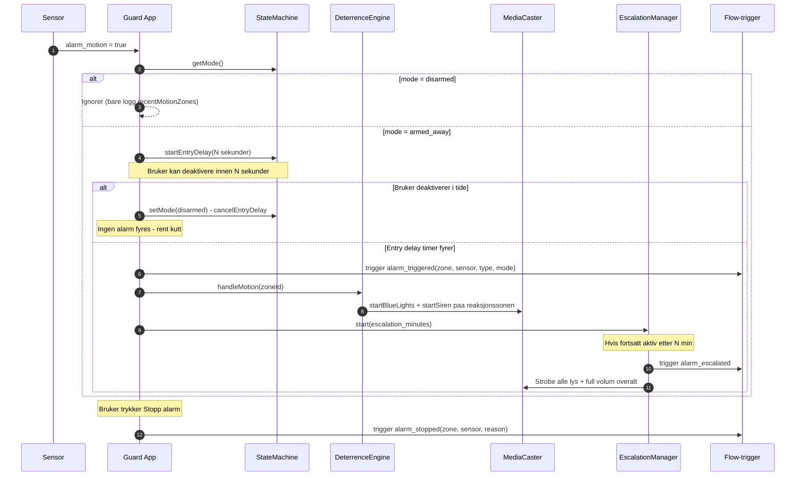

# McCallister Guard

> Alene Hjemme-inspirert smart sikkerhet for Homey Pro — psykologisk avskrekking av tyver med lyd, video og lys i stedet for bare alarm-sirener.

[](https://apps.developer.homey.app/) [](LICENSE)

McCallister Guard er ikke enda et passivt alarmsystem. I stedet for å bare tute når noen bryter seg inn, **forteller den tyven at huset er bebodd og at noen følger med** — gjennom lyder (bjeffing, sirener), video (blålys, store hunder, silhuetter i vinduet) og lysmønstre som etterligner et hjem i full aktivitet. Inspirasjonen er Kevin McCallister fra *Alene Hjemme* (1990): vinn ved å få tyven til å snu i døra.

## Funksjoner

- **Tre moduser** — `Hjemme` (deaktivert), `Borte` (full overvåking + Kevin-simulering), `Skallsikring` (kun valgte perimeter-sensorer aktive — typisk når du sover)
- **Skallsikring med sensorvalg** — pek ut nøyaktig hvilke sensorer (ytterdører, vinduer, uteområder) som skal kunne utløse alarm ved Skallsikring; bevegelse innendørs ignoreres
- **Sone-basert avskrekking** — bevegelse i én sone trigger media i en annen «reaksjonssone» (matrise konfigurerbar per sone), så tyven aldri møter responsen sin der hen er
- **Adaptiv media** — direkte cast til skjermer med `cast_url`, og «soft cast»-deteksjon (Chromecast, Google Cast, Nest Hub, Sonos, AirPlay) som kan styres via Homey-flow; lys faller tilbake til blå/rød strobing hvis ingen skjerm finnes
- **Kevin-modus** — automatisk tilstedeværelses-simulering i Borte-modus (lys av/på i sannsynlig sekvens)
- **Lys-autorisering** — manuell lysbruk under armert tilstand kan tolkes som «noen er hjemme» og deaktivere alarm
- **Eskalering** — om avskrekking ikke får tyven til å snu, eskalerer alarmen til krise-nivå (full sirene, strobe på alle lys)
- **Falsk-alarm-filter** — flere uavhengige sensor-treff kreves før eskalering starter
- **Flow-kort** — actions, conditions og triggers (inkl. `mode_changed` og `timestamp`-token) for full integrasjon med Homey-flows (push, SMS, kamera, naboalarmer)
- **Norsk-først UI** — settings-panelet på norsk med engelsk fallback

## Skjermbilder

| Dashbord (modusvalg) | Sone-konfigurasjon | Eventlogg |
|---|---|---|
| _kommer_ | _kommer_ | _kommer_ |

## Arkitektur

```mermaid
flowchart TB
  subgraph UI[Settings UI - dashboard og konfigurasjon]
    DASH[Dashbord]
    ZONES[Sone-blokker]
  end

  subgraph API[Internal API /api/*]
    STATUS[/status]
    SETMODE[/setMode]
    TESTD[/testDeterrence]
    STOP[/stopAlarm]
  end

  subgraph APP[McCallisterGuardApp]
    SM[StateMachine - mode + entry/exit delay]
    AS[alarmActive - state separate from mode]
    FAF[FalseAlarmFilter]
    DE[DeterrenceEngine]
    MC[MediaCaster]
    LAG[LightAuthGuard]
    SIM[SimulationEngine - Kevin-modus]
    EM[EscalationManager]
    CAM[CameraManager]
    EL[EventLog]
  end

  subgraph HOMEY[Homey Platform]
    DEV[Sensorer og lys]
    CAST[Cast-skjermer og høyttalere]
    FLOW[Flow-motor]
    NOTIF[Push og varslinger]
  end

  UI <--> API
  API <--> APP
  DEV -- alarm_motion - alarm_contact --> APP
  APP -- onoff - cast_url - volume_set --> DEV
  APP -- cast_url --> CAST
  APP -- trigger alarm_triggered - alarm_stopped - deterrence_started --> FLOW
  FLOW --> NOTIF
  SM --> AS
  DE --> MC
  EM --> MC
```

### Alarmflyt — fra detektering til krise



## Komponenter

| Modul | Ansvar |
|---|---|
| `app.ts` | Hovedklasse — orkestrering, listener-registrering, alarm-state |
| `StateMachine` | Modus + entry/exit delays |
| `DeterrenceEngine` | Velger reaksjonssone, kjører media, håndterer mørklegging |
| `MediaCaster` | Auflöser URL-er, caster video/lyd, fallback til lys-strobing |
| `EscalationManager` | Timer fra avskrekking til full krise + strobe-rutine |
| `FalseAlarmFilter` | Krever konfidens-terskel før eskalering |
| `LightAuthGuard` | Tolker manuell lysbruk som «noen er hjemme» |
| `SimulationEngine` | Kevin-modus: lys-mønstre i Borte-modus |
| `CameraManager` | Starter opptak fra sone-kameraer ved alarm |
| `EventLog` | Strukturert hendelseslogg (vises i settings-UI) |
| `Capabilities` | Klassifiserer enheter (audio/video/light/sensor) inkl. «soft cast»-deteksjon |

## Flow-kort

### Triggers

| Kort | Tokens | Når |
|---|---|---|
| `alarm_triggered` | `zone`, `sensor`, `sensor_type`, `mode`, `timestamp` | Når sensor bekrefter innbrudd (etter evt. entry delay) |
| `alarm_stopped` | `zone`, `sensor`, `reason` | Når en aktiv alarm avsluttes |
| `mode_changed` | `mode_new`, `mode_previous` | Når systemet bytter modus (uavhengig av alarm) |
| `deterrence_started` | `zone` | Når avskrekking starter i en sone |
| `alarm_escalated` | — | Når eskalering når krise-nivå |
| `health_check_failed` | `offline_count` | Når sensorer er offline ved aktivering |

### Conditions

| Kort | Tilstand |
|---|---|
| `alarm_active` | Alarm er utløst akkurat nå |
| `is_armed` | Systemet er i valgt modus |
| `deterrence_active` | Avskrekking pågår |

### Actions

| Kort | Effekt |
|---|---|
| `set_mode` | Sett modus til Hjemme / Borte / Skallsikring |
| `trigger_panic` | Utløs panikk-alarm umiddelbart |


## Installasjon

### Krav

- Homey Pro (Early 2023 eller nyere) med firmware ≥ 12.4.0
- Node.js 18+ og npm for utvikling
- [Homey CLI](https://apps.developer.homey.app/the-basics/getting-started/cli)

### Bygg og installer på Homey

```bash
git clone https://github.com/thomasekdahlN/mcallisteralarm.git
cd mcallisteralarm/com.mccallister.guard
npm install
homey app install
```

### Konfigurasjon

1. Åpne **Innstillinger → Apper → McCallister Guard → Konfigurer app**.
2. Under **Soneoversikt**, utvid hver sone og se hvilke kapabiliteter (🔊 lyd, 📺 skjerm, 💡 lys) og sensorer
   (🚪 dør/vindu, 👁️ bevegelse) som er oppdaget.
3. Definer **reaksjonssone-matrise** per sone — f.eks. «bevegelse på loft → spill avskrekking i stua».
4. Sett **lyd-/video-URL** per sone hvis du vil overstyre defaults (forslag fra `assets/media/` er forhåndsutfylt).
5. **Skallsikring:** hak av sensorene som skal være aktive i Skallsikring-modus (typisk ytterdører, vinduer,
   uteområder). Andre sensorer ignoreres når Skallsikring er aktiv.
6. **Cast-skjermer uten `cast_url`:** for Chromecast/Nest Hub/Sonos som ikke eksponerer direkte URL-cast, bygg
   en Homey-flow på `alarm_triggered`-trigger og bruk `Cast en URL`-actionen i den respektive cast-appen
   (bruk `zone`-token for å velge riktig enhet).
7. Sett **Borte-modus** når du forlater huset, eller bruk `set_mode`-actionen fra en flow (geofence, bryter,
   stemme). Bruk `mode_changed`-trigger til logging eller automatikk rundt modus-bytter.

## Utvikling

```bash
npm test              # Vitest unit-tests (29 tester)
npx tsc --noEmit      # TypeScript type-check
npm run lint          # ESLint (Athom config)
homey app validate --level publish  # Athom App Store validation
homey app run         # Kjør lokalt mot Homey for live testing
```

### Mappestruktur

```
com.mccallister.guard/
├── app.ts                  # Hovedklasse
├── api.ts                  # Internal HTTP API for settings-UI
├── lib/                    # Moduler (StateMachine, DeterrenceEngine, …)
├── settings/index.html     # Settings-UI (vanilla JS)
├── assets/media/           # Bundlede CC-lyder/videoer
├── .homeycompose/flow/     # Flow-kort (triggers, conditions, actions)
├── docs/                   # Spesifikasjon og arkitektur
└── test/                   # Vitest unit-tests
```

### Test-strategi

| Test | Dekker |
|---|---|
| `StateMachine.test.ts` | Modus-overganger, entry/exit delays |
| `FalseAlarmFilter.test.ts` | Konfidens-terskel og reset-logikk |
| `EventLog.test.ts` | Strukturert logging med trimming |

## Lisens og credits

- **App-kode**: MIT — se [LICENSE](LICENSE)
- **Mediafiler**: Creative Commons (CC-BY) — se `assets/media/CREDITS.md`
- **Inspirasjon**: *Home Alone* (1990), regi John Hughes — alle Kevin-feller er rein fan-fiction

## Bidra

Issues og PR-er er velkomne. Se [CONTRIBUTING.md](CONTRIBUTING.md) og [CODE_OF_CONDUCT.md](CODE_OF_CONDUCT.md). For større endringer, åpne et issue først for å diskutere.
