# McCallister Guard

> Alene Hjemme-inspirert smart sikkerhet for Homey Pro — psykologisk avskrekking av tyver med lyd, video og lys i stedet for bare alarm-sirener.

[](https://apps.developer.homey.app/) [](LICENSE)

McCallister Guard er ikke enda et passivt alarmsystem. I stedet for å bare tute når noen bryter seg inn, **forteller den tyven at huset er bebodd og at noen følger med** — gjennom lyder (bjeffing, sirener), video (blålys, store hunder, silhuetter i vinduet) og lysmønstre som etterligner et hjem i full aktivitet. Inspirasjonen er Kevin McCallister fra *Alene Hjemme* (1990): vinn ved å få tyven til å snu i døra.

## Funksjoner

- **Fem moduser** — `Hjemme` / `disarmed` (deaktivert), `Borte` / `armed` (full overvåking + Kevin-simulering), `Skallsikring` / `armed_perimeter` (kun valgte perimeter-sensorer aktive — typisk når du sover), `Avskrekking` / `deterrence` (lys-blink i reaksjonssone — advarselsfase), `Alarm` / `alarm` (full krise — sirene og strobe)
- **Skallsikring med sensorvalg** — pek ut nøyaktig hvilke sensorer (ytterdører, vinduer, uteområder) som skal kunne utløse alarm ved Skallsikring; bevegelse innendørs ignoreres
- **Inngangsforsinkelse (⏱) pr. sensor** — marker hoveddør/bakdør med ⏱ for å gi en `entry_delay`-nedtelling (default 30 s) ved åpning, slik at en autorisert bruker med kodelås/smart-lås rekker å deaktivere systemet før alarmen utløses
- **Sone-basert avskrekking** — bevegelse i én sone trigger avskrekking i en annen «reaksjonssone» (matrise konfigurerbar per sone), så tyven aldri møter responsen sin der hen er
- **Konfigurerbar lys-avskrekking** — appen blinker lys i reaksjonssonen med en sakte syklus (PÅ/AV-tid konfigurerbar pr. sone, default 15 sek hver vei). Modus-endringer kan brukes i `mode_changed`-triggeren til å bygge egne Homey-flows
- **Kevin-modus** — automatisk tilstedeværelses-simulering i Borte-modus (lys av/på i sannsynlig sekvens)
- **Lys-autorisering** — uautorisert lysbruk under armert tilstand oppdages, logges og slås umiddelbart av; kun app-initierte kommandoer tillates (tyv kan ikke «gjemme seg» ved å skru på lys). Kun oppdagelsen logges — om korreksjonen lykkes eller feiler loggføres ikke for å holde loggene rene.
- **Eskalering** — om avskrekking ikke får tyven til å snu, eskalerer systemet automatisk til Alarm-modus etter konfigurert tid (full sirene, strobe på alle lys)
- **Falsk-alarm-filter** — flere uavhengige sensor-treff kreves før eskalering starter
- **Flow-kort** — actions, conditions og triggers (inkl. `mode_changed` og `timestamp`-token) for full integrasjon med Homey-flows (push, SMS, kamera, naboalarmer)
- **Homey Timeline-logging** — modus-bytter (Av/Borte/Skallsikring), avskrekking startet, alarm utløst/stoppet og krise-eskalering postes til Homey-app-en sin Timeline via `homey.notifications.createNotification`, parallelt med appens egen interne event-logg
- **Norsk-først UI** — settings-panelet på norsk med engelsk fallback

## Skjermbilder

<p align="center">
  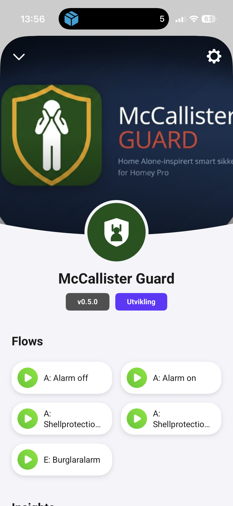
  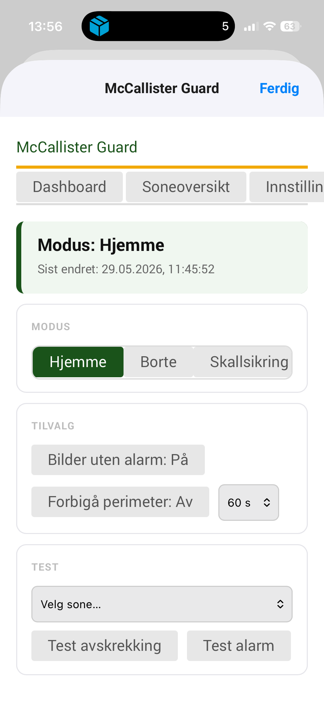
  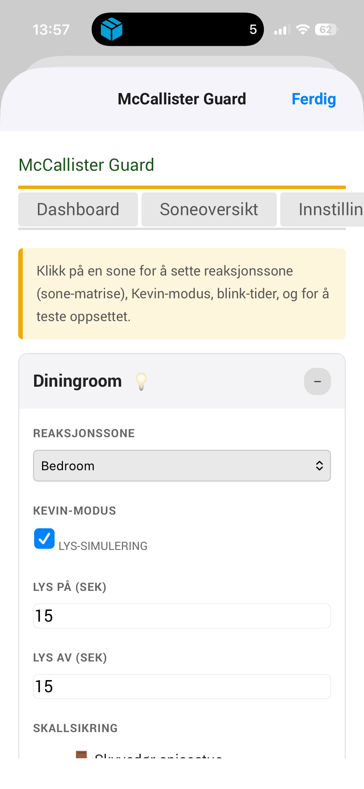
</p>
<p align="center">
  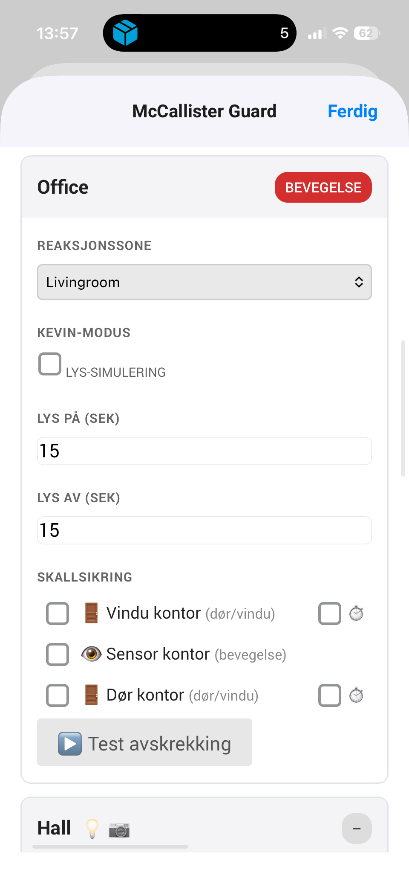
  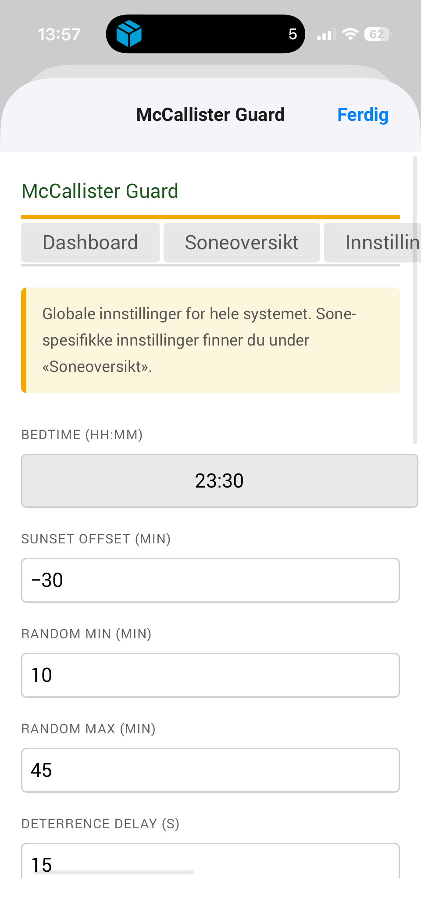
  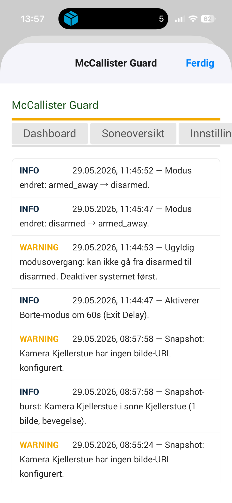
</p>

## Arkitektur

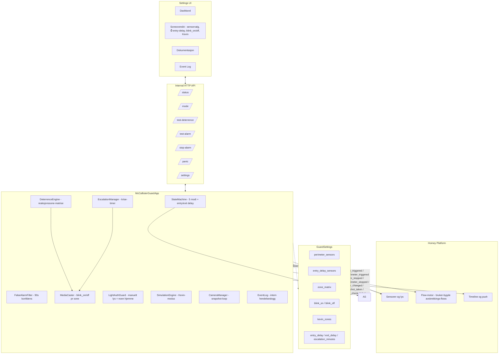

### Modus-tilstandsmaskin

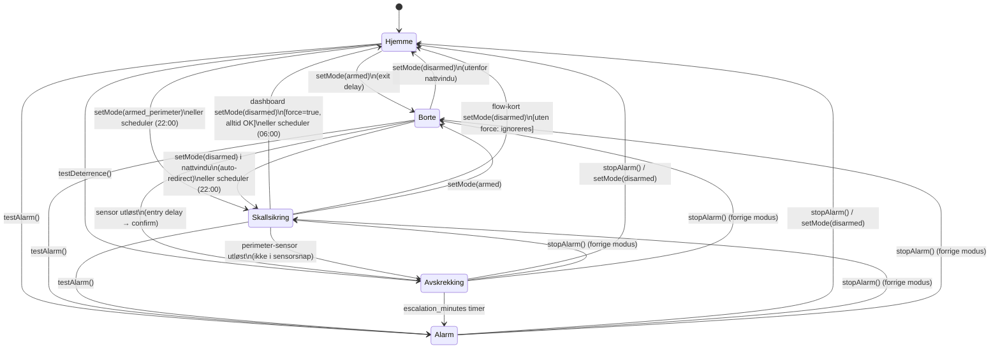

### Sensor-rute — fra detektering til krise

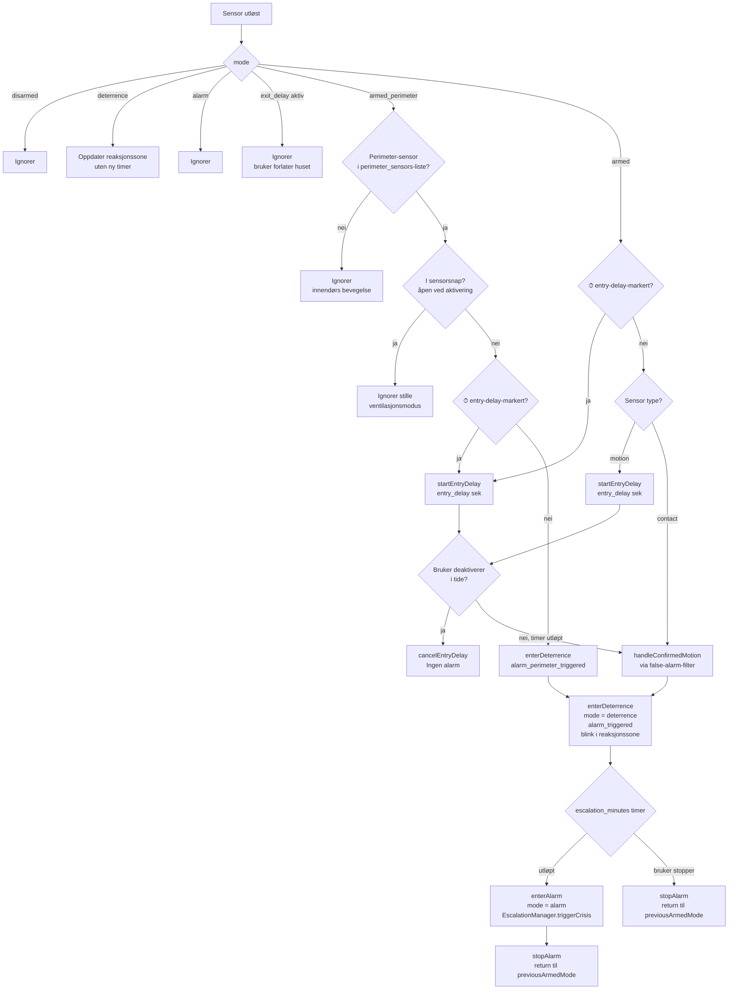

### Inngangsforsinkelse (⏱) — autorisert inngang med kodelås

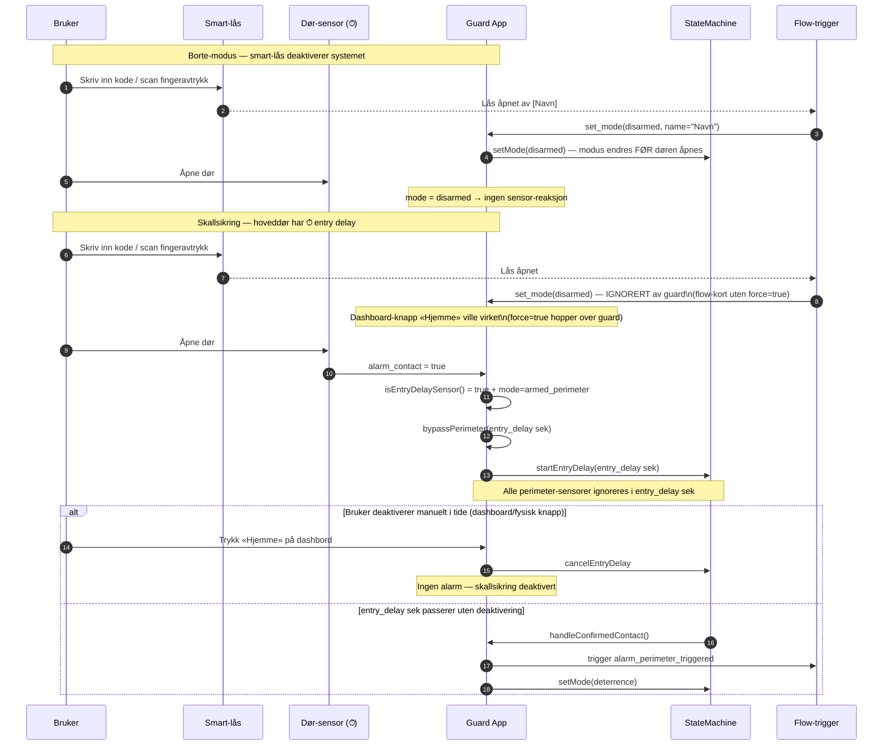

### Avskrekkings-flow — innebygd lys-blink og modus-endring

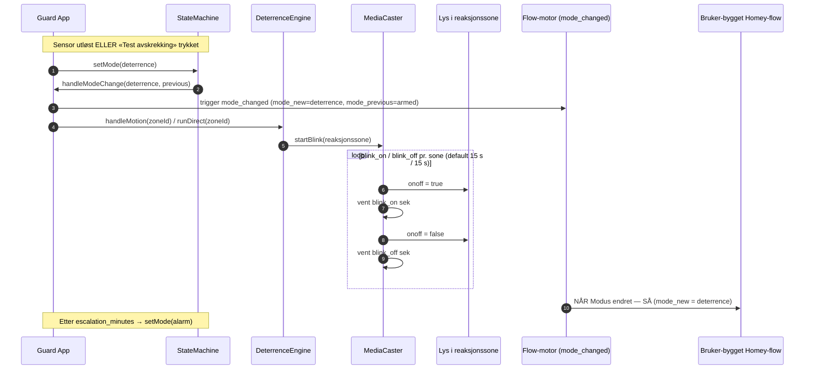

## Komponenter

| Modul | Ansvar |
|---|---|
| `app.ts` | Hovedklasse — orkestrering, sensor-listeners, alarm-state, entry-delay-routing for motion + ⏱-dører |
| `StateMachine` | Modus + entry/exit delays (felles timer for både motion og ⏱-dører) |
| `DeterrenceEngine` | Velger reaksjonssone fra `zone_matrix` og starter lys-blink i reaksjonssonen |
| `MediaCaster` | Lys-blink i reaksjonssonen med konfigurerbar PÅ/AV-syklus (`blink_on`/`blink_off` pr. sone, default 15 s / 15 s) |
| `EscalationManager` | Timer fra alarm til full krise + strobe-rutine på alle lys |
| `FalseAlarmFilter` | Krever (kontakt + bevegelse) eller bevegelse i to soner innen 90 s før eskalering |
| `LightAuthGuard` | Blokkerer uautorisert lysbruk under armert tilstand (slår av umiddelbart); deaktivert under aktiv avskrekking så eksterne flows kan styre lys trygt |
| `SimulationEngine` | Kevin-modus: lys-mønstre i Borte-modus på markerte soner |
| `CameraManager` | Snapshot-loop fra sone-kameraer ved alarm (hopper over soner uten kameraer) |
| `EventLog` | Strukturert intern hendelseslogg (vises i Event Log-fanen i settings-UI) |
| `Capabilities` | Klassifiserer enheter (`isLight` krever `device.class === 'light'`) for UI-visning og blink-utvalg |

## Flow-kort

### Triggers

| Kort | Tokens | Når |
|---|---|---|
| `alarm_triggered` | `zone`, `sensor`, `sensor_type`, `mode`, `timestamp` | Sensor aktiverer alarm i **Borte** (`armed`) — etter entry delay |
| `alarm_perimeter_triggered` | `zone`, `sensor`, `sensor_type`, `mode`, `timestamp` | Sensor aktiverer alarm i **Skallsikring** (`armed_perimeter`) — etter entry delay |
| `alarm_stopped` | `zone`, `sensor`, `reason` | Borte-alarm stoppet (av bruker, deaktivering eller automatisk) |
| `alarm_perimeter_stopped` | `zone`, `sensor`, `reason` | Skallsikring-alarm stoppet |
| `mode_changed` | `mode_new`, `mode_previous` | Systemet bytter modus — inkl. overgang til `deterrence` og `alarm` |
| `snapshot_taken` | `zone`, `sensor`, `sensor_type`, `mode`, `timestamp`, `snapshot` (image) | Kamera tar snapshot ved alarm |
| `health_check_failed` | `offline_count` | Sensorer er offline ved aktivering |

### Conditions

| Kort | Tilstand |
|---|---|
| `alarm_active` | Systemet er i `alarm`-modus (full alarm utløst) |
| `alarm_perimeter_active` | Systemet er i `armed_perimeter`-modus (Skallsikring aktiv) |
| `get_mode` | Systemet er i valgt modus — dropdown med alle 5 modi |
| `alarm_triggered_from` | Pågående alarm/avskrekking ble utløst fra valgt modus (`armed` / `armed_perimeter`) |

### Actions

| Kort | Effekt |
|---|---|
| `set_mode` | Sett modus til Hjemme / Borte / Skallsikring (med valgfritt navn — vises i Timeline ved deaktivering) |
| `trigger_deterrence` | Test avskrekking direkte i valgt sone |
| `trigger_alarm` | Test full alarm (eskalering, stopp etter 15 s) |
| `bypass_perimeter` | Deaktiver perimeter-sensorene midlertidig (antall minutter) |
| `set_camera_motion` | Aktiver / deaktiver bevegelsesutløst kamera-opptak |


## Alarmtyper — to trigger-kort, én condition for forgrening

| Situasjon | Trigger-kort å bruke |
|---|---|
| Dør/vindu/sensor åpnet i **Skallsikring** | `alarm_perimeter_triggered` |
| Innendørs bevegelse/kontakt i **Borte** | `alarm_triggered` |
| Under aktiv `alarm`- eller `deterrence`-fase — differensier reaksjon | `alarm_triggered_from` (condition) |

### Typisk reaksjon per kilde

| Kilde | Typisk flow-reaksjon |
|---|---|
| `alarm_perimeter_triggered` | Lokal varsling (lyd i gangen, blink ute), push kun til deg — du er antakelig hjemme og sover |
| `alarm_triggered` | Full push til alle i husstanden, kamera-snapshot, kraftig avskrekking, ring nødkontakt |
| Under `alarm` + condition `alarm_triggered_from = armed_perimeter` | Mild eskalering — vekk beboerne, ingen politimelding |
| Under `alarm` + condition `alarm_triggered_from = armed` | Full eskalering — sirene, politimelding, push med høyest prioritet |

### Eksempel-flows — alarmreaksjon

```
NÅR  Skallsikring-brudd oppdaget (alarm_perimeter_triggered)
SÅ   Push til DEG: «Noen ved [[sensor]] (sone: [[zone]])»
     Skru på alle lys i 1. etasje
     Spill bjeffende hund på gang-høyttaler

NÅR  Alarm aktivert (alarm_triggered — Borte-modus)
SÅ   Push til ALLE i husstanden
     Ta kamera-snapshot
     Start sirene + blink i hele huset
     Ring nødkontakt via IFTTT/SMS

NÅR  Modus endret (mode_changed, mode_new = alarm)
OG   Alarm ble utløst fra [Borte (armed)]   ← alarm_triggered_from condition
SÅ   Send SMS til politiet / nødkontakt

NÅR  Modus endret (mode_changed, mode_new = alarm)
OG   Alarm ble utløst fra [Skallsikring]    ← alarm_triggered_from condition
SÅ   Vekk beboerne (intern sirene) — ingen ekstern varsling
```

### Anbefalte flows — deaktivering og aktivering

#### Deaktivering via smart-lås (anbefalt)

Koble deaktivering til **autorisert opplåsing av smart-lås** med brukerens navn som token.
Ikke bruk presence-sensorer (GPS/Bluetooth) til å deaktivere — de er for upresise og kan
skru av alarmen mens du er på nabobesøk.

```
NÅR  Smart-lås: Lås åpnet av [bruker]       ← smart-lås-trigger med navn-token
DA   Sett modus til Hjemme av [[bruker]]    ← set_mode action (name = låsens bruker-token)
```

**Hva skjer i ulike modi:**

| Aktiv modus | Resultat |
|---|---|
| `armed` (Borte) — utenfor nattvindu | Systemet deaktiveres normalt før døren åpnes — ingen alarm |
| `armed` (Borte) — **i nattvindu** | `set_mode=disarmed` omdirigeres automatisk til `armed_perimeter` — huset går til Skallsikring i stedet for å deaktiveres helt. Forhindrer at en smart-lås-flow lar huset stå ubeskyttet om natten. |
| `armed_perimeter` (Skallsikring) | `set_mode=disarmed` fra **dashboard** virker alltid (force=true). `set_mode=disarmed` fra **flow-kort uten force** ignoreres — hoveddøren har entry delay som starter perimeter-bypass automatisk. |
| `disarmed` | Ingen effekt |

> **Nattvindu-redirect:** Omdirigering fra `armed` til `armed_perimeter` gjelder kun når den innebygde Skallsikring-scheduleren er aktivert (Innstillinger → Skallsikring auto) og klokken er innenfor det konfigurerte tidsrommet (f.eks. 22:00–06:00). Automatisk scheduler og `force=true` fra interne flows går forbi denne logikken.

#### Aktivering basert på tilstedeværelse (anbefalt)

Bruk presence-sensorer til å **aktivere** Borte-modus, ikke til å deaktivere.
Dette er trygt fordi false positives (tror feil at huset er tomt) er langt mindre farlig
enn false negatives (deaktiverer alarmen mens du ikke er hjemme).

```
NÅR  Tilstedeværelse: Ingen hjemme          ← Homey presence / zone-trigger
OG   Modus er [Hjemme (disarmed)]           ← get_mode condition (unngå å re-arme fra perimeter)
DA   Sett modus til Borte                   ← set_mode = armed
```

> **Merk:** Bruk `get_mode = disarmed` som condition for å unngå at presence-flowen
> overskriver en eksisterende `armed_perimeter` (nattmodus) når alle forlater huset om morgenen.

#### Aktivering av Skallsikring (nattmodus)

```
NÅR  Klokken er 22:00
OG   Modus er [Hjemme (disarmed)]
DA   Sett modus til Skallsikring
```

Alternativt: bruk den innebygde tidsplanleggeren i appen (Innstillinger → Skallsikring auto).

> **Scheduleren aktiverer kun ved overganger.** Aktivering skjer nøyaktig når klokken passerer ON-tidspunktet (f.eks. 22:00) og deaktivering ved OFF-tidspunktet (f.eks. 06:00). Ved appstart gjøres ingen automatisk aktivering/deaktivering — den lagrede modusen beholdes som den er.

#### Ventilasjonsmodus — Skallsikring med åpne vinduer

Når Skallsikring aktiveres tar appen et øyeblikksbilde av hvilke **konfigurerte perimeter-sensorer** som allerede er åpne. Disse sensorene ignoreres stille for resten av sesjonen — du kan sove med et vindu på gløtt uten å utløse alarm. Nye åpninger (vinduer/dører som åpnes *etter* aktivering) reagerer normalt.

> **Merk:** Øyeblikksbildet bruker kun sensorer som eksplisitt er konfigurert som perimeter-sensorer i Soneoversikten. Hvis ingen sensorer er konfigurert, tas det ikke noe øyeblikksbilde.

```
Eksempel:
  22:00 — Skallsikring aktiveres
          Vindu bad: alarm_contact = true  ← allerede åpent → ignoreres
          Hoveddør:  alarm_contact = false ← lukket → normal beskyttelse

  23:15 — Noen åpner kjøkkendøren
          alarm_contact = true (ny åpning) → inngangsforsinkelse starter → alarm
```

Øyeblikksbildet nullstilles automatisk når Skallsikring deaktiveres.

#### Helsesjekk ved Borte-aktivering

Når systemet settes til Borte (`armed`) sjekker appen alle dør- og vindu-sensorer. Er noen åpne, sendes en push-notifikasjon til Homey-appen og en advarsel logges. Armering stoppes ikke — varslingen er utelukkende informativ slik at du kan bestemme deg for å lukke vinduet eller godta risikoen.

---

### Anbefalte flows — kameraopptak ved alarm

> **Homey-begrensning:** Appen kan ikke ta bilder fra kameraer direkte. Homey tillater ikke at
> en tredjepartsapp kaller en annen apps action-kort (f.eks. «Ta snapshot») fra koden — dette
> er kun mulig fra Flow-editoren. Du må derfor opprette **én flow per kamera** du ønsker å trigge.

Appen sender `zone`-tokenet med `alarm_triggered` og `alarm_perimeter_triggered`. Bruk dette
som condition for å velge riktig kamera:

```
NÅR  Alarm utløst (alarm_triggered)
OG   [[zone]] inneholder "Inngang"          ← Homey Logic: tekst-condition
DA   [Kamera-app]: Ta snapshot fra [inngang-kamera]
     Telegram: Send melding med bilde [[snapshot]]

NÅR  Alarm utløst (alarm_triggered)
OG   [[zone]] inneholder "Garasje"
DA   [Kamera-app]: Ta snapshot fra [garasje-kamera]
     Telegram: Send melding med bilde [[snapshot]]
```

**Forutsetning:** Kamera-appen (Reolink, Eufy, Unifi Protect, ONVIF m.fl.) må ha et
«Ta snapshot»-action-kort i Flow-editoren som returnerer et bildetoken. Sjekk dette i
kamera-appens dokumentasjon på Homey App Store.

**Tilgjengelige tokens fra appen:**

| Token | Innhold |
|---|---|
| `[[zone]]` | Navn på sonen der sensoren utløste alarmen |
| `[[sensor]]` | Navn på sensoren som utløste alarmen |
| `[[sensor_type]]` | `motion` eller `contact` |
| `[[mode]]` | Aktiv modus da alarmen ble utløst |
| `[[timestamp]]` | ISO 8601-tidsstempel |

---

### Anbefalte flows — lyd og video ved avskrekking

> **Homey-begrensning:** Appen kan ikke starte lyd- eller videoavspilling på høyttalere, TV-er
> eller Chromecast direkte fra kode. Homeys plattform eksponerer tredjepartsappers flow-kort
> (f.eks. «Spill lyd», «Cast video») **kun via Flow-editoren** — ikke via noe API en custom app
> kan kalle. Du må derfor opprette flows manuelt for å koble avskrekking til lyd og video.

Appen fyrer `mode_changed` (mode_new = deterrence) og `alarm_triggered` / `alarm_perimeter_triggered`
som integrasjonspunkter. Lys-avskrekking (blink i reaksjonssone) kjører alltid automatisk —
lyd og video må settes opp som bruker-flows.

```
NÅR  Modus endret (mode_changed)
OG   mode_new = deterrence
DA   Sonos / Homey-høyttaler: Spill «bjeffing.mp3» med volum 80 %
     Chromecast: Cast video «blålys.mp4» til stue-TV

NÅR  Alarm utløst (alarm_perimeter_triggered)
DA   [Høyttaler i gang]: Spill «advarsel.mp3»
     Push til DEG: «Noen ved [[sensor]]»

NÅR  Modus endret (mode_changed)
OG   mode_new = disarmed
DA   Sonos: Stop avspilling
     Chromecast: Stop avspilling
```

**Tips:**
- Bruk `alarm_triggered_from`-condition under aktiv `alarm`-fase for å spille ulike lyder
  avhengig av om alarmen kom fra Borte- eller Skallsikring-modus.
- Appen deaktiverer lys-vakta (`LightAuthGuard`) mens avskrekking pågår — egne flows kan
  trygt styre lys i reaksjonssonen parallelt med innebygd blink.
- Volum-kontroll på tredjepartshøyttalere må gjøres i samme flow — appen har ikke tilgang
  til dette fra koden.


## Sett opp flows basert på modus-endringer

Systemet har fem modi: `disarmed` (Hjemme), `armed` (Borte), `armed_perimeter` (Skallsikring), `deterrence` (Avskrekking), `alarm` (Alarm utløst). Overganger mellom disse fyrer alltid `mode_changed`-triggeren med `mode_new` og `mode_previous` som tokens.

### Generelt mønster

I Flow-editoren (`Homey-appen → Flows → Ny flow`):

1. **NÅR** — `McCallister Guard → Modus endret`
2. **OG** *(valgfritt)* — filtrer på `[mode_new]` eller `[mode_previous]` for å reagere på spesifikke overganger.
3. **SÅ** — kjør ønsket handling (push, SMS, tenn lys, aktiver scene, o.l.)

### Eksempel 1 — push når avskrekking starter

```text
NÅR  McCallister Guard → Modus endret
OG   mode_new = deterrence
SÅ   Homey → Send a push notification
       Tittel:  Avskrekking aktiv
       Tekst:   Lys blinker. Sjekk kamera i Homey-appen.
```

### Eksempel 2 — ring nødkontakt ved full alarm

```text
NÅR  McCallister Guard → Modus endret
OG   mode_new = alarm
SÅ   Ring nødkontakt via IFTTT/SMS
     Send push med høyest prioritet til alle
```

### Eksempel 3 — logg modus-historikk

```text
NÅR  McCallister Guard → Modus endret
SÅ   Google Sheet → Legg til rad: [mode_new], [mode_previous], [tidspunkt]
```

### Test og feilsøking

- **«Test avskrekking»-knappen** i Soneoversikten setter systemet i `deterrence`-modus direkte — bruk den for å verifisere at flows som lytter på `mode_changed` (mode_new = deterrence) fungerer.
- **«Test alarm»-knappen** i Soneoversikten setter systemet i `alarm`-modus og stopper etter 15 sekunder.
- I **Event Log** ser du alltid aktuell modus-linje ved hvert modus-bytte.
- Bruk `get_mode`-condition for å sjekke aktiv modus i flows uten å lytte på `mode_changed`.
- Bruk `alarm_triggered_from`-condition under `alarm`- eller `deterrence`-fasen for å skille mellom «vi var hjemme» og «vi var borte».


## Installasjon

### Krav

- Homey Pro (Early 2023 eller nyere) med firmware ≥ 12.4.0
- Node.js 18+ og npm for utvikling
- [Homey CLI](https://apps.developer.homey.app/the-basics/getting-started/cli)

### Bygg og installer på Homey

```bash
git clone https://github.com/thomasekdahlN/mcallisteralarm.git
cd mcallisteralarm/com.mccallister.guard
npm install
homey app install
```

### Konfigurasjon

1. Åpne **Innstillinger → Apper → McCallister Guard → Konfigurer app**.
2. Under **Soneoversikt**, utvid hver sone og se hvilke kapabiliteter (🔊 lyd, 📺 skjerm, 💡 lys) og sensorer
   (🚪 dør/vindu, 👁️ bevegelse) som er oppdaget.
3. Definer **reaksjonssone-matrise** per sone — f.eks. «bevegelse på loft → spill avskrekking i stua».
4. **Skallsikring:** i hver sone listes alle dør-/vindu- og bevegelses-sensorer. Den første avkrysningsboksen
   markerer sensoren som aktiv i Skallsikring-modus (typisk ytterdører, vinduer, uteområder). Andre sensorer
   ignoreres når Skallsikring er aktiv.
5. **Inngangsforsinkelse (⏱):** for dør-/vindu-sensorer kan du krysse av **⏱** for å gi sensoren en
   inngangsforsinkelse. Når en slik dør åpnes (i Borte eller Skallsikring), starter en nedtelling på
   `entry_delay` sekunder (default 30) før alarmen utløses — slik at en autorisert bruker som kommer inn med
   kodelås/smart-lås rekker å deaktivere systemet uten å sette i gang sirenen. Anbefales for hoveddør og
   bakdør med kodelås. Kombiner gjerne med en flow som automatisk sender `set_mode = Hjemme` når smartlåsen
   rapporterer autorisert opplåsing — da utløses ingen alarm i det hele tatt, og inngangsforsinkelsen er
   fallback hvis flowen feiler.

   > **Merk:** `set_mode = Hjemme` ignoreres hvis systemet er i **Skallsikring**. Noen som kommer hjem sent
   > deaktiverer ikke nattmodus automatisk — endre modus manuelt på dashbordet om nødvendig.
   > Sendes `set_mode = Hjemme` mens systemet er i **Alarm**, stoppes alarmen og systemet deaktiveres helt.
6. **Lys-avskrekking pr. sone:** appen blinker lys i reaksjonssonen med en sakte PÅ/AV-syklus (default
   15 sek hver vei, justerbart pr. sone under «Lys på (sek)» / «Lys av (sek)»). Lys-vakta (`LightAuthGuard`)
   er deaktivert mens avskrekking pågår, så en ekstern flow kan trygt styre lys i sonen samtidig. Bruk
   `mode_changed`-triggeren (mode_new = deterrence) for egne flows som reagerer på avskrekking.
7. Sett **Borte-modus** når du forlater huset, eller bruk `set_mode`-actionen fra en flow (geofence, bryter,
   stemme). Bruk `mode_changed`-trigger til logging eller automatikk rundt modus-bytter.

## Utvikling

```bash
npm test              # Vitest unit-tests (29 tester)
npx tsc --noEmit      # TypeScript type-check
npm run lint          # ESLint (Athom config)
npm run build:images  # Regenerer App Images (250×175 / 500×350 / 1000×700) fra design/appartwork.png
homey app validate --level publish  # Athom App Store validation
homey app run         # Kjør lokalt mot Homey for live testing
```

### Grafikk og master-filer

Athom skiller mellom to typer app-grafikk; vi følger samme terminologi.

| Type | Master (`design/`) | Distribusjon (`assets/`) | Krav |
|---|---|---|---|
| **App Icon** (lite, rundt monokromt badge) | `design/appicon.svg` (og `appicon.png` for forhåndsvisning) | `assets/icon.svg` | Vektor, viewBox 0 0 1024 1024 |
| **App Images** (fargerikt App Store-artwork) | `design/appartwork.png` | `assets/images/small.png` (250×175), `large.png` (500×350), `xlarge.png` (1000×700) | PNG, eksakte dimensjoner (10:7) |

App-ikonet kopieres direkte (samme SVG som master). App Images regenereres fra `design/appartwork.png` med `npm run build:images` — skriptet bruker macOS-native `sips` og fit-cover + center-crop for å bevare aspekt-forhold uten distorsjon.

### Mappestruktur

```
com.mccallister.guard/
├── app.ts                  # Hovedklasse
├── api.ts                  # Internal HTTP API for settings-UI
├── lib/                    # Moduler (StateMachine, DeterrenceEngine, …)
├── settings/index.html     # Settings-UI (vanilla JS)
├── assets/icon.svg         # App Icon (badge) — kopi av design/appicon.svg
├── assets/images/          # App Images (App Store artwork) — generert fra design/appartwork.png
├── assets/media/           # Bundlede CC-lyder/videoer
├── design/                 # Master-filer for grafikk (appicon, appartwork)
├── scripts/                # Hjelpe-skript (build-app-images.sh)
├── .homeycompose/flow/     # Flow-kort (triggers, conditions, actions)
├── docs/                   # Spesifikasjon og arkitektur
└── test/                   # Vitest unit-tests
```

### Test-strategi

| Test | Dekker |
|---|---|
| `StateMachine.test.ts` | Modus-overganger, entry/exit delays |
| `FalseAlarmFilter.test.ts` | Konfidens-terskel og reset-logikk |
| `EventLog.test.ts` | Strukturert logging med trimming |

## Casting til Chromecast / Samsung TV — hva vi lærte

Et stort mål med appen var å programmatisk spille av video («blålys i vinduet», silhuett av en stor person, bjeffende hund) på Chromecast, Google Nest Hub og Samsung TV. Det viste seg å være **vesentlig vanskeligere** enn forventet på Homey-plattformen. Disse funnene er notert her slik at vi ikke gjentar utforskningen — og fordi de utgjør en reell svakhet i Homey-økosystemet.

### Hva vi prøvde

| # | Tilnærming | Resultat |
|---|---|---|
| B | Bruke `speaker_playing`-capability på cast-enheten | Begrenset — kan kun resume en tidligere cast-sesjon, ikke velge URL eller media |
| C | Auto-generere Homey-flows programmatisk fra app-kode | ❌ Blokkert — `homey:manager:api`-permission gir kun `homey.flow.readonly` for tredjepartsapper |
| E | HomeyScript-bro: kall `homey.flow.runFlowCardAction({ uri, id, args })` fra et script | ❌ Blokkert — selv HomeyScript med fulle bruker-scopes (`homey.flow`) får `Not Found: FlowCardAction with ID castVideo` på alle 1044 testede kombinasjoner |
| D | Embedde `castv2-client` direkte i appen og snakke Chromecast-protokollen | Teoretisk mulig, men krever IP-discovery (vi har bare Homey-device-ID), vedlikehold når Google endrer protokollen, separat Tizen-implementasjon for Samsung — og bryter Athoms anbefalte arkitektur |
| A | Bruker oppretter Homey-flow manuelt, appen fyrer en trigger flowen lytter på | ✅ **Fungerer** — Flow-editoren har separat tilgang til alle apper sine flow-kort |

### Hvorfor B/C/E feiler

Tredjepartsapper på Homey (som Chromecast og Samsung TV) eksponerer flow-kortene sine **utelukkende via Flow-editorens interne grensesnitt**. Disse kortene er ikke tilgjengelige via:

- Web API / `homey-api` SDK
- HomeyScript (selv med `homey.flow`-scope)
- App-til-app-kall innenfor en custom app

Dette er en bevisst arkitektonisk grense fra Athom — eller en bug — men resultatet er det samme: en custom app kan **ikke** programmatisk be Chromecast-appen om å spille av en URL. Selv «universelle» actions som `Cast a video` og `sendKey` returnerer konsistent `Not Found` når de kalles fra utsiden av Flow-editoren.

Vi har også verifisert at `cast_url`-capability ikke er eksponert på Chromecast-/Samsung TV-enheter i praksis — bare på et lite knippe driver-implementasjoner (typisk LG WebOS og enkelte projektor-apper).

### Hva vi gjorde i stedet — modus-basert integrasjon

Pivoten ble løsning A: **systemet bytter modus til `deterrence` når avskrekking starter, og brukeren bygger valgfritt sin egen flow** som reagerer på `mode_changed` (mode_new = deterrence). Flow-en kan da kjøre `Cast a video` / `Cast a website` på Chromecast eller `Send key` på Samsung TV.

Innebygd lys-avskrekking (`MediaCaster.startBlink` — sakte PÅ/AV-syklus på lys-enheter i reaksjonssonen, default 15 sek hver vei, konfigurerbart pr. sone) **kjører alltid** når avskrekking starter. Dette gir et fornuftig system out-of-the-box og sikrer at brukeren får visuell avskrekking selv om Chromecast-en er offline eller flowen er deaktivert.

Mens avskrekking pågår, deaktiveres lys-vakta (`LightAuthGuard`) for reaksjonssonen, slik at en ekstern flow trygt kan styre lys i sonen parallelt med blinkingen uten å bli slått av igjen.

### Konsekvenser for fremtidige Homey-apper

Hvis du planlegger en app som trenger å styre tredjepartsenheter (særlig media) via deres «pene» flow-actions: regn med at du **må** bygge oppskriften rundt at brukeren oppretter en flow selv. Et trigger-kort fra din egen app er den eneste pålitelige broen til andre apper. Dokumenter dette tydelig i UI-en.

## Begrensninger i Homey-plattformen — funksjoner vi har måttet fjerne eller delegere

Underveis har vi ryddet bort funksjonalitet som **virket riktig på papiret, men som Homey-plattformen ikke faktisk lar en custom app gjøre**. Vi lar denne listen stå eksplisitt slik at neste utvikler (og vi selv om seks måneder) ikke bruker dager på å gjenoppdage hvorfor disse veiene ikke fungerer.

| Funksjon vi prøvde | Hvorfor det ikke fungerer på Homey | Hva vi gjør i stedet |
|---|---|---|
| **Direkte cast av lyd/video til Chromecast / Nest Hub / Samsung TV fra app-kode** | Tredjepartsappers flow-actions (`Cast a URL`, `Cast a video`, `sendKey`) er kun eksponert via Flow-editorens interne grensesnitt, ikke via Web API, HomeyScript eller app-til-app-kall. | Brukeren bygger en flow som lytter på `mode_changed` (mode_new = deterrence) og ruter selv til Chromecast-actionen. |
| **Per-sone lyd-URL og video-URL i settings (`zone_audio_urls`, `zone_video_urls`)** | Det fantes ingen pålitelig måte å spille av disse på i runtime — `cast_url`-capability er nesten aldri eksponert på Chromecast-/Samsung-enheter. Feltene ble bare et løfte vi ikke kunne innfri. | Fjernet helt. Brukeren legger URL inn i sin egen flow-action. |
| **Globalt «Standard lyd-URL»-felt (`custom_audio_url`)** | Samme begrensning — vi kunne ikke kalle noen action for å spille den av. | Fjernet helt. |
| **Cast-enhet-prioritering pr. sone (`cast_devices`, `CastPriority`-modul)** | Vi kunne ranke devices, men ikke faktisk pushe innhold til dem programmatisk. Ren UI uten effekt. | Fjernet helt. `Capabilities`-modulen rapporterer fortsatt at en sone har skjerm/høyttaler i info-badgen, men plukker ikke lenger ut «beste» device. |
| **Auto-generere Homey-flows programmatisk fra app-kode** | `homey:manager:api`-permission gir custom apper kun `homey.flow.readonly` — ingen `create`/`update` på flows. | Brukeren må manuelt opprette en avskrekkings-flow. Vi dokumenterer mønsteret tydelig i sone-UI og README. |
| **HomeyScript-bro for å kalle tredjepartsappers actions** (`homey.flow.runFlowCardAction({ uri, id, args })`) | Selv HomeyScript med fulle bruker-scopes returnerer `Not Found: FlowCardAction with ID …` på alle 1044 testede uri/id-kombinasjoner mot Chromecast/Samsung. Funksjonen er praksis dead-end for custom apper. | Forkastet. Modus-endringer via `mode_changed`-triggeren + bruker-flow er den eneste fungerende broen. |
| **Bruke `speaker_playing`-capability for å resume cast-sesjon** | Kun å resume en eksisterende sesjon, ikke å velge URL/innhold. Ubrukelig for å starte en avskrekking. | Forkastet. |
| **Embedde `castv2-client` / Tizen-protokoll direkte i appen** | Krever IP-discovery (vi har bare Homey-device-ID), parallell vedlikehold når Google/Samsung endrer protokollen, separat implementasjon pr. plattform — bryter Athoms anbefalte arkitektur. | Vurdert og forkastet. Ikke verdt det. |
| **Cast-skjermer-info-banner pr. sone** (advarsel om at oppdaget skjerm ikke støtter direkte cast) | Ble misvisende — vi sa «bruk en Homey-flow» uten å gi brukeren noe sted å klikke. | Fjernet. `mode_changed`-triggeren er det offisielle integrasjonspunktet for brukerens egne flows. |
| **Programmatisk velge / kjøre en spesifikk Homey-flow fra app-kode** (per-sone dropdown med flow-ID som ble lagret i `deterrent_flows`) | Det finnes **ingen `runFlow(flowId)`-API for tredjepartsapper** på Homey. `homey.flow.getFlows()` er `readonly`, og det finnes ingen imperativ måte å fyre en valgt flow fra koden. | Helt fjernet. Systemet endrer modus — brukerens flow lytter på `mode_changed`. `getFlows`-API-endepunktet (`/flows`) er fjernet. |
| **«Jeg har laget en ekstern flow»-avkrysning pr. sone** (boolean i `deterrent_flows`) | Avkrysningen styrte kun om `LightAuthGuard` skulle «la flowen overta» lyset. I praksis var dette unødvendig kompleksitet: lys-vakta er uansett deaktivert mens avskrekking pågår, så en parallell flow kan trygt styre lys uansett. | Fjernet. Innstillingene har nå kun «Lys på (sek)» / «Lys av (sek)» pr. sone for å justere blink-tempoet (default 15/15). `deterrent_flows`-feltet er borte; gamle verdier ignoreres. |
| **600 ms strobing** | Tidligere blinket lysene 600 ms av/på som en politilys-effekt. Det fungerte teknisk, men ga ofte hørbar klikke-lyd i relébaserte enheter, akselererte slitasje på Hue/IKEA-pærer og gjorde at noen sone-til-zigbee-broer droppet kommandoer pga. trafikk. | Erstattet med en sakte PÅ/AV-syklus styrt av `blink_on`/`blink_off` pr. sone (default 15 sek hver vei, justerbart i Soneoversikten). |
| **«Blinke med alle enheter som har `onoff`»** | Tidligere filter krevde bare `onoff`-capability + ikke-sensor. Resultatet var at varmekabler, panelovner, frysere, smartplugger, vifter og TV-er ble forsøkt strobet under avskrekking — uønsket og potensielt skadelig. | Strikt filter: `isLight()` krever nå `device.class === 'light'` i tillegg til `onoff`. Brukt konsekvent i `MediaCaster.startLightStrobe`/`stopZone`, `SimulationEngine` (Kevin-syklus), `LightAuthGuard.handleOnOffChange`, og listener-registrering i `app.ts`. Hvis en smartplugg skal kunne brukes som lys (f.eks. juletre), endre `class` til `light` i Homey-enhetens innstillinger. |
| **Snapshot-loop i alle soner med bevegelse** | `CameraManager.startForZone()` startet et `setInterval` i hver sone det var bevegelse i, og filtrerte først ut kamera-enheter på hvert tick. Resultatet var bortkastet planlegging og loop-logg-støy i soner uten kameraer. | `startForZone()` slår nå opp `isCamera(d)` på sonens enheter først og hopper helt over loopen hvis ingen kameraer finnes. Loggen sier «Snapshot-loop hoppes over: ingen kameraer i sone X». |

### Hvor vises bildene fra snapshot-loopen?

Bilder lagres til `/userdata/snapshots/alarm/` og `/userdata/snapshots/motion/` og vises i **Bilder**-fanen i settings-UI. Homey-platformens `notifications.createNotification`-API tar kun tekst — den støtter ikke å feste et bilde direkte. Ønsker du å sende bildene eksternt (Telegram, e-post, Dropbox), må du bygge en flow som lytter på en `snapshot_taken`-trigger med et image-token.

---

## Kamera-snapshot — alt vi har prøvd og hvorfor det ikke fungerer

Et viktig mål var å ta bilder fra kameraer ved alarm og bevegelse. Det viste seg vesentlig vanskeligere enn forventet på Homey-plattformen. Alt vi har testet er dokumentert nedenfor slik at vi ikke gjentar det.

### Oversikt over forsøk

| # | Tilnærming | Resultat |
|---|---|---|
| 1 | `device.images[0].url` — lese bilde-URL direkte fra enhetsobjektet | Feiler — feltet er tomt i alle tilfeller vi har testet |
| 2 | `homeyApi.images.getImage({ id })` — hente ett bilde via ManagerImages | Feiler — metoden eksisterer ikke i HomeyAPIV3Local |
| 3 | `homeyApi.images.getImages()` + `ownerUri`-matching | Delvis — virker kun hvis kamera-driveren kaller `device.setCameraImage()` |
| 4 | Direkte HTTP-nedlasting med Bearer-token | Virker teknisk, men krever en gyldig URL fra tilnærming 1–3 |
| 5 | `image.getStream()` på bilde-objekter fra lokal API | Feiler — objektene er tomme JSON-stubs uten metoder |

### Detaljer per forsøk

#### 1. `device.images[0].url`

Det naturlige første steget var å lese `device.images` direkte fra enhetsobjektet som `homeyApi.devices.getDevices()` returnerer.

**Hva vi fant:** `HomeyAPIV3Local`-spesifikasjonen definerer `device.images` som en array av *tomme objekter* (`properties: {}`, `additionalProperties: false`). Feltet finnes i svaret, men innholdet er alltid tomt — ingen `url`, ingen `id`, ingen noe. Dette er ikke en dokumentasjonsfeil; det er faktisk slik Web API-en serialiserer enhetens bilde-liste i lokal modus.

**Konklusjon:** Ubrukelig for å hente URL.

---

#### 2. `homeyApi.images.getImage({ id })`

Vi forsøkte å bruke `ManagerImages.getImage()` til å hente et enkelt bilde med kjent ID (fra `device.images`-lista).

**Hva vi fant:** Metoden eksisterer ikke. `HomeyAPIV3Local.ManagerImages` har *kun* `getImages()` (flertall — henter alle). Det finnes ingen `getImage()`-metode for å hente ett og ett bilde.

**Konklusjon:** Kan ikke brukes.

---

#### 3. `homeyApi.images.getImages()` + `ownerUri`-matching

Homeys standardiserte kamera-system fungerer slik:

1. Kamera-driveren kaller `device.setCameraImage(image, 'front', 'Frontkamera')`.
2. Bildet registreres i `ManagerImages` med `ownerUri: "homey:device:{deviceId}"`.
3. Bildet er tilgjengelig via `GET /api/manager/images/image/{imageId}`.

Vi implementerte en oppslagstabell: hent alle bilder med `getImages()`, bygg en map `deviceId → imageUrl` basert på `ownerUri`, og bruk denne når vi vet kamera-ID-en.

**Kode (`CameraManager.refreshZoneCache`):**
```typescript
const allImages = await this.homeyApi.images.getImages();
for (const img of Object.values(allImages)) {
  const match = img.ownerUri?.match(/^homey:device:(.+)$/);
  if (match) deviceImageUrl.set(match[1], img.url);
}
```

**Hva vi fant:** Fungerer *bare* hvis kamera-driveren faktisk kaller `device.setCameraImage()`. For kameraene vi testet (bl.a. «Kamera Hall») er det ingenting i `getImages()`-svaret som matcher enheten — driveren registrerer ingen bilder i ManagerImages. Dette er et driverproblem, ikke noe vi kan omgå fra app-koden.

**Konklusjon:** Riktig tilnærming for kameraer med standard Homey-driver. Feiler stille for kameraer som ikke implementerer `setCameraImage()`.

---

#### 4. Direkte HTTP-nedlasting med Bearer-token

Siden `homeyApi`-SDK-et ikke gir oss bilde-data direkte, forsøkte vi å laste ned JPEG-en via HTTP med Homeys eget lokale API.

**Flyt:**
```
1. homey.api.getLocalUrl()       → base-URL (f.eks. "http://192.168.x.x")
2. homey.api.getOwnerApiToken()  → Bearer-token
3. fetch(baseUrl + imageUrl, { Authorization: `Bearer ${token}` })
4. Buffer.from(await response.arrayBuffer()) → JPEG-buffer → skriv til /userdata/
```

**Hva vi fant:** Mekanismen virker teknisk sett. Men den forutsetter at vi allerede har en gyldig `imageUrl` fra tilnærming 1, 2 eller 3 — og det har vi ikke når ingen av dem returnerer en URL. Feilmeldingen er da «ingen bilde-URL konfigurert» (før HTTP-kallet i det hele tatt skjer).

**Konklusjon:** Riktig nedlastingsmekanisme. Avhengig av at URL-en kan løses opp fra et av de andre stegene.

---

#### 5. `image.getStream()` på bilde-objekter fra lokal API

I `HomeyAPI`-SDK-et finnes det en `Image`-klasse med en `getStream()`-metode som returnerer en Node.js-stream. Vi prøvde å kalle denne på bilde-objektene vi fikk tilbake fra `getImages()`.

**Hva vi fant:** Image-objektene fra `HomeyAPIV3Local` er rene JSON-stubs — de er *ikke* instanser av `Image`-klassen. De har ingen metoder; bare feltene `id`, `url`, `ownerUri` og `lastUpdated`. `getStream()` eksisterer ikke på disse objektene.

`getStream()` finnes kun på `Image`-instanser du selv oppretter via `this.homey.images.createImage()` — altså bilder du produserer fra appen, ikke bilder du henter fra eksterne enheter.

**Konklusjon:** Kan ikke brukes for å hente snapshot fra kamera.

---

### Rotårsak

Det finnes **ingen standardisert, garantert API** i Homey Web API v3 Local for å hente et snapshot fra et vilkårlig kamera. Alt avhenger av at kamera-driveren frivillig implementerer `device.setCameraImage()`. Gjør den ikke det, er det ingenting en tredjepartsapp kan gjøre.

Homey App Store-siden for en kamera-app vil typisk si «støtter snapshot» eller liste `camera`-capability — sjekk dette før du velger kamera-app.

### Hva vi gjør nå

`CameraManager` bruker tilnærming 3 (ownerUri-matching) som primær kilde og tilnærming 1 (device.images fallback) som sekundær. Nedlastingen skjer via tilnærming 4 (direkte HTTP). Dersom ingen URL finnes, logges en advarsel og kameraet hoppes over stille.

For kameraer som ikke støtter Homeys native snapshot-API kan en mulig workaround være å legge inn en manuell RTSP/HTTP-snapshot-URL direkte i innstillingene (ikke implementert per nå — meld fra om det er ønsket).

---

### Kjente begrensninger som **fortsatt** gjelder (uten kjent workaround per i dag)

- Vi kan ikke programmatisk vite om brukerens flow faktisk lyktes — `triggerCard.trigger()` returnerer kun at triggeren ble fyrt, ikke om noen flow plukket den opp eller om Chromecast-actionen faktisk spilte av. Det er grunnen til at vi alltid kjører blink-fallback i parallell.
- Vi kan ikke programmatisk trigge en spesifikk flow ved ID. Eneste broen til en flow er at vi fyrer en trigger og brukerens flow lytter selv (med `zone`-filter om ønskelig).
- Volum-kontroll på tredjepartshøyttalere fra app-kode er **ikke** mulig av samme årsak som casting. Hvis flow-en din skal skru opp volum, må også dét gjøres som en handling i flow-en.
- Vi kan ikke detektere om en Chromecast/Sonos er i bruk av noen andre når avskrekkingen starter — det er opp til brukerens flow å håndtere «interrupt»-logikk.
- Vi kan ikke feste bilder til Homey-notifikasjoner (`notifications.createNotification` tar kun tekst). Snapshot-loopen sender derfor kun tekst-varsler i dag — bildene må eksponeres via en flow med image-token hvis brukeren skal kunne se dem.

## Lisens og credits

- **App-kode**: MIT — se [LICENSE](LICENSE)
- **Mediafiler**: Creative Commons (CC-BY) — se `assets/media/CREDITS.md`
- **Inspirasjon**: *Home Alone* (1990), regi John Hughes — alle Kevin-feller er rein fan-fiction

## Bidra

Issues og PR-er er velkomne. Se [CONTRIBUTING.md](CONTRIBUTING.md) og [CODE_OF_CONDUCT.md](CODE_OF_CONDUCT.md). For større endringer, åpne et issue først for å diskutere.
