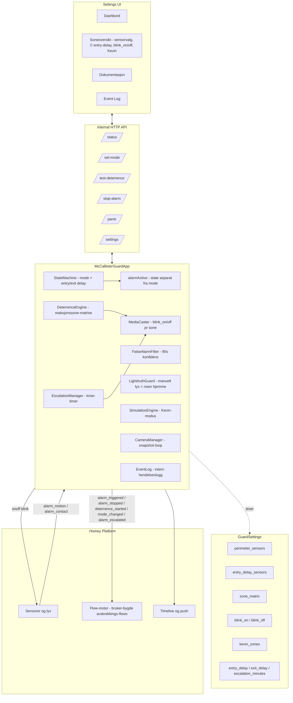
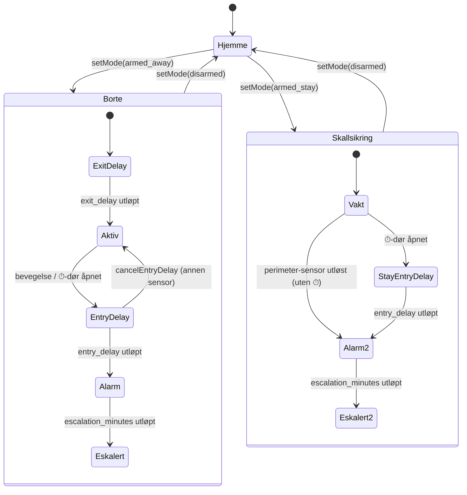
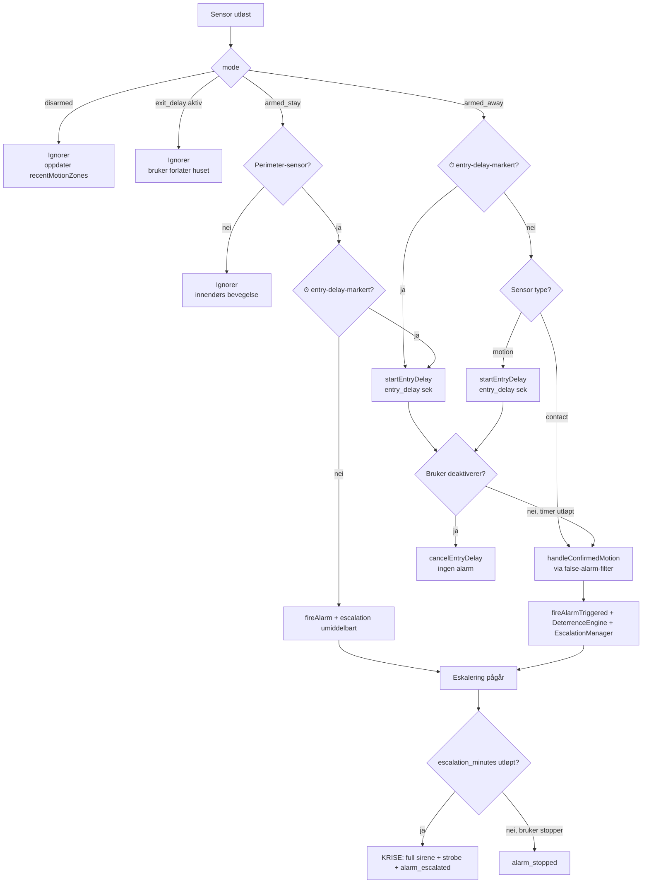
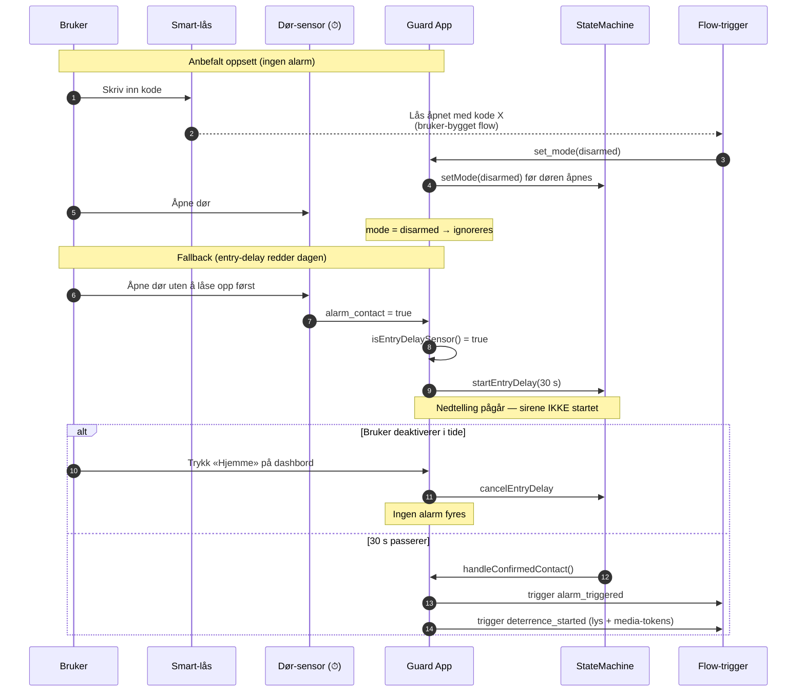
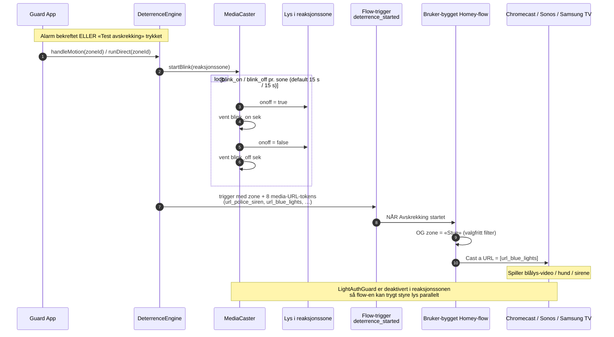

# McCallister Guard

> Alene Hjemme-inspirert smart sikkerhet for Homey Pro — psykologisk avskrekking av tyver med lyd, video og lys i stedet for bare alarm-sirener.

[](https://apps.developer.homey.app/) [](LICENSE)

McCallister Guard er ikke enda et passivt alarmsystem. I stedet for å bare tute når noen bryter seg inn, **forteller den tyven at huset er bebodd og at noen følger med** — gjennom lyder (bjeffing, sirener), video (blålys, store hunder, silhuetter i vinduet) og lysmønstre som etterligner et hjem i full aktivitet. Inspirasjonen er Kevin McCallister fra *Alene Hjemme* (1990): vinn ved å få tyven til å snu i døra.

## Funksjoner

- **Tre moduser** — `Hjemme` (deaktivert), `Borte` (full overvåking + Kevin-simulering), `Skallsikring` (kun valgte perimeter-sensorer aktive — typisk når du sover)
- **Skallsikring med sensorvalg** — pek ut nøyaktig hvilke sensorer (ytterdører, vinduer, uteområder) som skal kunne utløse alarm ved Skallsikring; bevegelse innendørs ignoreres
- **Inngangsforsinkelse (⏱) pr. sensor** — marker hoveddør/bakdør med ⏱ for å gi en `entry_delay`-nedtelling (default 30 s) ved åpning, slik at en autorisert bruker med kodelås/smart-lås rekker å deaktivere systemet før alarmen utløses
- **Sone-basert avskrekking** — bevegelse i én sone trigger media i en annen «reaksjonssone» (matrise konfigurerbar per sone), så tyven aldri møter responsen sin der hen er
- **Konfigurerbar lys-avskrekking** — appen blinker lys i reaksjonssonen med en sakte syklus (PÅ/AV-tid konfigurerbar pr. sone, default 15 sek hver vei). Samtidig fyrer den `deterrence_started`-triggeren slik at du fritt kan bygge en Homey-flow som spiller lyd/video/animasjoner via Chromecast, Sonos, Hue eller annet
- **Bundlede media som flow-tokens** — `deterrence_started`-triggeren leverer ferdige URL-tokens til alle medfølgende lyder (bjeffende vakthund, politisirene, brannalarm, …) og videoer (blålys, politi-silhuett, stor hund). Dra-og-slipp inn i `Cast a URL`/`Cast a video` på Chromecast eller Sonos uten å hoste filene selv
- **Kevin-modus** — automatisk tilstedeværelses-simulering i Borte-modus (lys av/på i sannsynlig sekvens)
- **Lys-autorisering** — manuell lysbruk under armert tilstand kan tolkes som «noen er hjemme» og deaktivere alarm
- **Eskalering** — om avskrekking ikke får tyven til å snu, eskalerer alarmen til krise-nivå (full sirene, strobe på alle lys)
- **Falsk-alarm-filter** — flere uavhengige sensor-treff kreves før eskalering starter
- **Flow-kort** — actions, conditions og triggers (inkl. `mode_changed` og `timestamp`-token) for full integrasjon med Homey-flows (push, SMS, kamera, naboalarmer)
- **Homey Timeline-logging** — modus-bytter (Av/Borte/Skallsikring), avskrekking startet, alarm utløst/stoppet og krise-eskalering postes til Homey-app-en sin Timeline via `homey.notifications.createNotification`, parallelt med appens egen interne event-logg
- **Norsk-først UI** — settings-panelet på norsk med engelsk fallback

## Skjermbilder

| Dashbord (modusvalg) | Sone-konfigurasjon | Eventlogg |
|---|---|---|
| _kommer_ | _kommer_ | _kommer_ |

## Arkitektur



### Modus-tilstandsmaskin



### Sensor-rute — fra detektering til krise



### Inngangsforsinkelse (⏱) — autorisert inngang med kodelås



### Avskrekkings-flow — innebygd lys + ekstern media via flow-trigger



## Komponenter

| Modul | Ansvar |
|---|---|
| `app.ts` | Hovedklasse — orkestrering, sensor-listeners, alarm-state, entry-delay-routing for motion + ⏱-dører |
| `StateMachine` | Modus + entry/exit delays (felles timer for både motion og ⏱-dører) |
| `DeterrenceEngine` | Velger reaksjonssone fra `zone_matrix`, starter blink og fyrer `deterrence_started`-trigger med media-URL-tokens |
| `MediaCaster` | Lys-blink i reaksjonssonen med konfigurerbar PÅ/AV-syklus (`blink_on`/`blink_off` pr. sone, default 15 s / 15 s) |
| `EscalationManager` | Timer fra alarm til full krise + strobe-rutine på alle lys |
| `FalseAlarmFilter` | Krever (kontakt + bevegelse) eller bevegelse i to soner innen 90 s før eskalering |
| `LightAuthGuard` | Tolker manuell lysbruk som «noen er hjemme»; deaktivert under aktiv avskrekking så eksterne flows kan styre lys trygt |
| `SimulationEngine` | Kevin-modus: lys-mønstre i Borte-modus på markerte soner |
| `CameraManager` | Snapshot-loop fra sone-kameraer ved alarm (hopper over soner uten kameraer) |
| `EventLog` | Strukturert intern hendelseslogg (vises i Event Log-fanen i settings-UI) |
| `Capabilities` | Klassifiserer enheter (`isLight` krever `device.class === 'light'`) for UI-visning og blink-utvalg |

## Flow-kort

### Triggers

| Kort | Tokens | Når |
|---|---|---|
| `alarm_triggered` | `zone`, `sensor`, `sensor_type`, `mode`, `timestamp` | Når sensor bekrefter innbrudd (etter evt. entry delay) |
| `alarm_stopped` | `zone`, `sensor`, `reason` | Når en aktiv alarm avsluttes |
| `mode_changed` | `mode_new`, `mode_previous` | Når systemet bytter modus (uavhengig av alarm) |
| `deterrence_started` | `zone`, `url_police_siren`, `url_fire_alarm`, `url_alarm_beep`, `url_guard_dog`, `url_intruder_voice`, `url_blue_lights`, `url_cop_silhouette`, `url_large_dog` | Når avskrekking starter i en sone. URL-tokens peker på bundlede lyd-/videofiler som hostes lokalt av appen og kan brukes direkte i `Cast a URL`-actions |
| `alarm_escalated` | — | Når eskalering når krise-nivå |
| `health_check_failed` | `offline_count` | Når sensorer er offline ved aktivering |

### Conditions

| Kort | Tilstand |
|---|---|
| `alarm_active` | Alarm er utløst akkurat nå |
| `is_armed` | Systemet er i valgt modus |
| `deterrence_active` | Avskrekking pågår |

### Actions

| Kort | Effekt |
|---|---|
| `set_mode` | Sett modus til Hjemme / Borte / Skallsikring |
| `trigger_panic` | Utløs panikk-alarm umiddelbart |


## Sett opp en avskrekkings-flow

Når avskrekking starter i en sone — enten utløst av reell bevegelse eller via «Test avskrekking»-knappen i
Soneoversikten — gjør appen to ting:

1. **Innebygd lys-blink** i reaksjonssonen (sakte PÅ/AV-syklus, default 15 sek hver vei, justerbart pr. sone).
2. **Fyrer flow-triggeren `deterrence_started`** med 9 tokens: `zone` + 8 ferdige, absolutte URL-er til lyd-
   og videofiler som ligger bundlet med appen og hostes lokalt på Homey-en.

Du trenger ikke gjøre noe annet for å få lys-blinkingen. Men hvis du vil legge til lyd, video, push, SMS eller
annet, bygger du selv en Homey-flow som lytter på `deterrence_started`.

### Tilgjengelige media-URL-tokens

Alle URL-ene leveres som ferdige `http://<homey-ip>/app/com.mccallister.guard/assets/media/<fil>`-strenger og
oppdateres automatisk hvis Homey-en bytter IP. Bare dra tokenet rett inn i URL-feltet på en cast-action.

| Token | Type | Fil | Innhold |
|---|---|---|---|
| `url_police_siren` | Lyd | `police-siren.ogg` | Politisirene |
| `url_fire_alarm` | Lyd | `fire-alarm.ogg` | Brannalarm |
| `url_alarm_beep` | Lyd | `alarm-beep.ogg` | Alarm-pip |
| `url_guard_dog` | Lyd | `guard-dog.ogg` | Vakthund som bjeffer |
| `url_intruder_voice` | Lyd | `intruder-voice.m4a` | Stemme-advarsel mot inntrenger |
| `url_blue_lights` | Video | `blue-lights.mp4` | Blålys (politi-effekt i vindu) |
| `url_cop_silhouette` | Video | `cop-silhouette.mp4` | Silhuett av politibetjent |
| `url_large_dog` | Video | `large-dog.mp4` | Stor hund i vindu |

### Generelt mønster

I Flow-editoren (`Homey-appen → Flows → Ny flow`):

1. **NÅR** — `McCallister Guard → Avskrekking startet i sone`
2. **OG** *(valgfritt)* — `Logikk → Tekst er lik` med token `[zone]` lik navnet på sonen du vil filtrere på.
   Lager du én flow pr. sone, kan du hoppe over dette steget og heller bruke `[zone]`-tokenet til å velge
   riktig destinasjons-enhet inne i actionen.
3. **SÅ** — en cast/play-action fra Chromecast-, Sonos-, Samsung TV- eller Hue-appen. Lim inn ett av URL-tokenene
   over i URL-feltet på actionen.

### Eksempel 1 — blålys-video på Chromecast i stua

```text
NÅR  McCallister Guard → Avskrekking startet i sone
OG   Logikk → Tekst er lik     [zone] === "Stue"
SÅ   Google Chromecast (Stue-TV) → Cast a video
       URL: [url_blue_lights]
```

### Eksempel 2 — vakthund-bjeffing på Sonos overalt

```text
NÅR  McCallister Guard → Avskrekking startet i sone
SÅ   Sonos (Hele huset) → Play a URL
       URL:    [url_guard_dog]
       Volum:  80 %
```

### Eksempel 3 — stemme-advarsel på Nest Hub i gangen

```text
NÅR  McCallister Guard → Avskrekking startet i sone
OG   Logikk → Tekst er lik     [zone] === "Gang"
SÅ   Google Chromecast (Nest Hub Gang) → Cast a URL
       URL: [url_intruder_voice]
```

### Eksempel 4 — politi-silhuett på Samsung TV (med automatisk på-slag)

```text
NÅR  McCallister Guard → Avskrekking startet i sone
OG   Logikk → Tekst er lik     [zone] === "Stue"
SÅ-1 Samsung TV (Stue) → Send key   KEY_POWER
SÅ-2 Vent 3 sekunder
SÅ-3 Samsung TV (Stue) → Cast a URL
       URL: [url_cop_silhouette]
```

### Eksempel 5 — push med dyplenke til kamera

```text
NÅR  McCallister Guard → Avskrekking startet i sone
SÅ   Homey → Send a push notification
       Tittel:  🚨 Avskrekking i [zone]
       Tekst:   Lys blinker. Sjekk kamera i Homey-appen.
```

### Test og feilsøking

- **Test-knappen i Soneoversikten** fyrer `deterrence_started` på nøyaktig samme måte som en reell alarm —
  perfekt for å sjekke at flowen din plukker opp triggeren.
- I **Event Log** vil du se en linje
  `Flow-trigger «deterrence_started» fyrt for sone <id> (8 media-URL tokens).` like etter triggering — dette
  er bekreftelse på at appen leverte triggeren med tokens. Om en lyttende flow finnes som plukker den opp,
  er Athom sitt ansvar; vi har levert vår del.
- URL-tokenene er statiske pr. installasjon. Hvis Homey-en din bytter IP, regenereres tokenene automatisk
  ved neste app-restart — du trenger ikke endre flowene dine.
- Hvis URL-en feiler (Chromecast offline, audio-format ikke støttet o.l.) skjer det stille i tredjeparts-appen.
  Lys-blinkingen kjører uansett, så avskrekkingen virker fortsatt.

### Hva tokenene faktisk peker på

Alle filer ligger i `assets/media/` i app-pakken. Når Homey laster appen, eksponeres katalogen automatisk
på `http://<homey-ip>/app/com.mccallister.guard/assets/media/`. Dette er en standard Homey-mekanisme — du
kan teste en URL ved å åpne den i nettleseren (forutsatt at du er på samme nettverk som Homey-en).

Filene er bevisst korte (10–30 sek) for å fungere bra som «alarm-loop» i Chromecast/Sonos-actions som
spiller URL-en én gang. Vil du ha en lengre loop, kombiner flere actions med «Vent N sekunder» mellom.


## Installasjon

### Krav

- Homey Pro (Early 2023 eller nyere) med firmware ≥ 12.4.0
- Node.js 18+ og npm for utvikling
- [Homey CLI](https://apps.developer.homey.app/the-basics/getting-started/cli)

### Bygg og installer på Homey

```bash
git clone https://github.com/thomasekdahlN/mcallisteralarm.git
cd mcallisteralarm/com.mccallister.guard
npm install
homey app install
```

### Konfigurasjon

1. Åpne **Innstillinger → Apper → McCallister Guard → Konfigurer app**.
2. Under **Soneoversikt**, utvid hver sone og se hvilke kapabiliteter (🔊 lyd, 📺 skjerm, 💡 lys) og sensorer
   (🚪 dør/vindu, 👁️ bevegelse) som er oppdaget.
3. Definer **reaksjonssone-matrise** per sone — f.eks. «bevegelse på loft → spill avskrekking i stua».
4. **Skallsikring:** i hver sone listes alle dør-/vindu- og bevegelses-sensorer. Den første avkrysningsboksen
   markerer sensoren som aktiv i Skallsikring-modus (typisk ytterdører, vinduer, uteområder). Andre sensorer
   ignoreres når Skallsikring er aktiv.
5. **Inngangsforsinkelse (⏱):** for dør-/vindu-sensorer kan du krysse av **⏱** for å gi sensoren en
   inngangsforsinkelse. Når en slik dør åpnes (i Borte eller Skallsikring), starter en nedtelling på
   `entry_delay` sekunder (default 30) før alarmen utløses — slik at en autorisert bruker som kommer inn med
   kodelås/smart-lås rekker å deaktivere systemet uten å sette i gang sirenen. Anbefales for hoveddør og
   bakdør med kodelås. Kombiner gjerne med en flow som automatisk setter modus til Hjemme når smartlåsen
   rapporterer autorisert opplåsing — da utløses ingen alarm i det hele tatt, og inngangsforsinkelsen er
   fallback hvis flowen feiler.
6. **Lys-avskrekking pr. sone:** appen blinker lys i reaksjonssonen med en sakte PÅ/AV-syklus (default
   15 sek hver vei, justerbart pr. sone under «Lys på (sek)» / «Lys av (sek)»). Vil du i tillegg spille av
   lyd/video på Chromecast, Sonos, Nest Hub e.l., bygger du selv en Homey-flow i Flow-editoren som lytter på
   `Avskrekking startet i en sone` (`deterrence_started`-triggeren) med filter på riktig `zone`. Triggeren
   leverer ferdige URL-tokens (`url_police_siren`, `url_guard_dog`, `url_blue_lights`, …) som peker på
   bundlede lyd-/videofiler — dra dem rett inn i `Cast a URL`/`Cast a video`-actions, så slipper du å hoste
   mediene selv. Lys-vakta (`LightAuthGuard`) er deaktivert mens avskrekking pågår, så en ekstern flow kan
   trygt styre lys i sonen samtidig.
7. Sett **Borte-modus** når du forlater huset, eller bruk `set_mode`-actionen fra en flow (geofence, bryter,
   stemme). Bruk `mode_changed`-trigger til logging eller automatikk rundt modus-bytter.

## Utvikling

```bash
npm test              # Vitest unit-tests (29 tester)
npx tsc --noEmit      # TypeScript type-check
npm run lint          # ESLint (Athom config)
npm run build:images  # Regenerer App Images (250×175 / 500×350 / 1000×700) fra design/appartwork.png
homey app validate --level publish  # Athom App Store validation
homey app run         # Kjør lokalt mot Homey for live testing
```

### Grafikk og master-filer

Athom skiller mellom to typer app-grafikk; vi følger samme terminologi.

| Type | Master (`design/`) | Distribusjon (`assets/`) | Krav |
|---|---|---|---|
| **App Icon** (lite, rundt monokromt badge) | `design/appicon.svg` (og `appicon.png` for forhåndsvisning) | `assets/icon.svg` | Vektor, viewBox 0 0 1024 1024 |
| **App Images** (fargerikt App Store-artwork) | `design/appartwork.png` | `assets/images/small.png` (250×175), `large.png` (500×350), `xlarge.png` (1000×700) | PNG, eksakte dimensjoner (10:7) |

App-ikonet kopieres direkte (samme SVG som master). App Images regenereres fra `design/appartwork.png` med `npm run build:images` — skriptet bruker macOS-native `sips` og fit-cover + center-crop for å bevare aspekt-forhold uten distorsjon.

### Mappestruktur

```
com.mccallister.guard/
├── app.ts                  # Hovedklasse
├── api.ts                  # Internal HTTP API for settings-UI
├── lib/                    # Moduler (StateMachine, DeterrenceEngine, …)
├── settings/index.html     # Settings-UI (vanilla JS)
├── assets/icon.svg         # App Icon (badge) — kopi av design/appicon.svg
├── assets/images/          # App Images (App Store artwork) — generert fra design/appartwork.png
├── assets/media/           # Bundlede CC-lyder/videoer
├── design/                 # Master-filer for grafikk (appicon, appartwork)
├── scripts/                # Hjelpe-skript (build-app-images.sh)
├── .homeycompose/flow/     # Flow-kort (triggers, conditions, actions)
├── docs/                   # Spesifikasjon og arkitektur
└── test/                   # Vitest unit-tests
```

### Test-strategi

| Test | Dekker |
|---|---|
| `StateMachine.test.ts` | Modus-overganger, entry/exit delays |
| `FalseAlarmFilter.test.ts` | Konfidens-terskel og reset-logikk |
| `EventLog.test.ts` | Strukturert logging med trimming |

## Casting til Chromecast / Samsung TV — hva vi lærte

Et stort mål med appen var å programmatisk spille av video («blålys i vinduet», silhuett av en stor person, bjeffende hund) på Chromecast, Google Nest Hub og Samsung TV. Det viste seg å være **vesentlig vanskeligere** enn forventet på Homey-plattformen. Disse funnene er notert her slik at vi ikke gjentar utforskningen — og fordi de utgjør en reell svakhet i Homey-økosystemet.

### Hva vi prøvde

| # | Tilnærming | Resultat |
|---|---|---|
| B | Bruke `speaker_playing`-capability på cast-enheten | Begrenset — kan kun resume en tidligere cast-sesjon, ikke velge URL eller media |
| C | Auto-generere Homey-flows programmatisk fra app-kode | ❌ Blokkert — `homey:manager:api`-permission gir kun `homey.flow.readonly` for tredjepartsapper |
| E | HomeyScript-bro: kall `homey.flow.runFlowCardAction({ uri, id, args })` fra et script | ❌ Blokkert — selv HomeyScript med fulle bruker-scopes (`homey.flow`) får `Not Found: FlowCardAction with ID castVideo` på alle 1044 testede kombinasjoner |
| D | Embedde `castv2-client` direkte i appen og snakke Chromecast-protokollen | Teoretisk mulig, men krever IP-discovery (vi har bare Homey-device-ID), vedlikehold når Google endrer protokollen, separat Tizen-implementasjon for Samsung — og bryter Athoms anbefalte arkitektur |
| A | Bruker oppretter Homey-flow manuelt, appen fyrer en trigger flowen lytter på | ✅ **Fungerer** — Flow-editoren har separat tilgang til alle apper sine flow-kort |

### Hvorfor B/C/E feiler

Tredjepartsapper på Homey (som Chromecast og Samsung TV) eksponerer flow-kortene sine **utelukkende via Flow-editorens interne grensesnitt**. Disse kortene er ikke tilgjengelige via:

- Web API / `homey-api` SDK
- HomeyScript (selv med `homey.flow`-scope)
- App-til-app-kall innenfor en custom app

Dette er en bevisst arkitektonisk grense fra Athom — eller en bug — men resultatet er det samme: en custom app kan **ikke** programmatisk be Chromecast-appen om å spille av en URL. Selv «universelle» actions som `Cast a video` og `sendKey` returnerer konsistent `Not Found` når de kalles fra utsiden av Flow-editoren.

Vi har også verifisert at `cast_url`-capability ikke er eksponert på Chromecast-/Samsung TV-enheter i praksis — bare på et lite knippe driver-implementasjoner (typisk LG WebOS og enkelte projektor-apper).

### Hva vi gjorde i stedet — «Deterrent Flow»

Pivoten ble løsning A: **appen fyrer alltid `deterrence_started`-triggeren når avskrekking starter i en sone, og brukeren bygger valgfritt sin egen flow** som plukker den opp. Flow-en lytter på:

1. `Avskrekking startet i en sone` med filter på riktig `zone`.
2. Kjører `Cast a video` / `Cast a website` på Chromecast eller `Send key` på Samsung TV — gjerne med en av URL-tokenene triggeren leverer (`url_guard_dog`, `url_police_siren`, `url_blue_lights`, …) som peker på bundlede mediefiler som appen hoster lokalt.

Innebygd lys-avskrekking (`MediaCaster.startBlink` — sakte PÅ/AV-syklus på lys-enheter i reaksjonssonen, default 15 sek hver vei, konfigurerbart pr. sone) **kjører alltid** når avskrekking starter. Dette gir et fornuftig system out-of-the-box og sikrer at brukeren får visuell avskrekking selv om Chromecast-en er offline, flowen er deaktivert eller URL-en feiler.

Mens avskrekking pågår, deaktiveres lys-vakta (`LightAuthGuard`) for reaksjonssonen, slik at en ekstern flow trygt kan styre lys i sonen parallelt med blinkingen uten å trigge «manuell lysbruk = noen er hjemme»-logikken.

### Konsekvenser for fremtidige Homey-apper

Hvis du planlegger en app som trenger å styre tredjepartsenheter (særlig media) via deres «pene» flow-actions: regn med at du **må** bygge oppskriften rundt at brukeren oppretter en flow selv. Et trigger-kort fra din egen app er den eneste pålitelige broen til andre apper. Dokumenter dette tydelig i UI-en.

## Begrensninger i Homey-plattformen — funksjoner vi har måttet fjerne eller delegere

Underveis har vi ryddet bort funksjonalitet som **virket riktig på papiret, men som Homey-plattformen ikke faktisk lar en custom app gjøre**. Vi lar denne listen stå eksplisitt slik at neste utvikler (og vi selv om seks måneder) ikke bruker dager på å gjenoppdage hvorfor disse veiene ikke fungerer.

| Funksjon vi prøvde | Hvorfor det ikke fungerer på Homey | Hva vi gjør i stedet |
|---|---|---|
| **Direkte cast av lyd/video til Chromecast / Nest Hub / Samsung TV fra app-kode** | Tredjepartsappers flow-actions (`Cast a URL`, `Cast a video`, `sendKey`) er kun eksponert via Flow-editorens interne grensesnitt, ikke via Web API, HomeyScript eller app-til-app-kall. | Brukeren bygger en flow med `deterrence_started`-triggeren og rute selv til Chromecast-actionen. URL-tokens for bundlede mediefiler leveres på triggeren. |
| **Per-sone lyd-URL og video-URL i settings (`zone_audio_urls`, `zone_video_urls`)** | Det fantes ingen pålitelig måte å spille av disse på i runtime — `cast_url`-capability er nesten aldri eksponert på Chromecast-/Samsung-enheter. Feltene ble bare et løfte vi ikke kunne innfri. | Fjernet helt. Brukeren legger URL inn i sin egen flow-action; vi tilbyr ferdige URL-tokens for våre bundlede filer. |
| **Globalt «Standard lyd-URL»-felt (`custom_audio_url`)** | Samme begrensning — vi kunne ikke kalle noen action for å spille den av. | Fjernet helt. |
| **Cast-enhet-prioritering pr. sone (`cast_devices`, `CastPriority`-modul)** | Vi kunne ranke devices, men ikke faktisk pushe innhold til dem programmatisk. Ren UI uten effekt. | Fjernet helt. `Capabilities`-modulen rapporterer fortsatt at en sone har skjerm/høyttaler i info-badgen, men plukker ikke lenger ut «beste» device. |
| **Auto-generere Homey-flows programmatisk fra app-kode** | `homey:manager:api`-permission gir custom apper kun `homey.flow.readonly` — ingen `create`/`update` på flows. | Brukeren må manuelt opprette en avskrekkings-flow. Vi dokumenterer mønsteret tydelig i sone-UI og README. |
| **HomeyScript-bro for å kalle tredjepartsappers actions** (`homey.flow.runFlowCardAction({ uri, id, args })`) | Selv HomeyScript med fulle bruker-scopes returnerer `Not Found: FlowCardAction with ID …` på alle 1044 testede uri/id-kombinasjoner mot Chromecast/Samsung. Funksjonen er praksis dead-end for custom apper. | Forkastet. Trigger-kort + bruker-flow er den eneste fungerende broen. |
| **Bruke `speaker_playing`-capability for å resume cast-sesjon** | Kun å resume en eksisterende sesjon, ikke å velge URL/innhold. Ubrukelig for å starte en avskrekking. | Forkastet. |
| **Embedde `castv2-client` / Tizen-protokoll direkte i appen** | Krever IP-discovery (vi har bare Homey-device-ID), parallell vedlikehold når Google/Samsung endrer protokollen, separat implementasjon pr. plattform — bryter Athoms anbefalte arkitektur. | Vurdert og forkastet. Ikke verdt det. |
| **Cast-skjermer-info-banner pr. sone** (advarsel om at oppdaget skjerm ikke støtter direkte cast) | Ble misvisende — vi sa «bruk en Homey-flow» uten å gi brukeren noe sted å klikke. | Fjernet. `deterrence_started`-triggeren er det offisielle integrasjonspunktet for brukerens egne flows. |
| **Programmatisk velge / kjøre en spesifikk Homey-flow fra app-kode** (per-sone dropdown med flow-ID som ble lagret i `deterrent_flows`) | Det finnes **ingen `runFlow(flowId)`-API for tredjepartsapper** på Homey. `homey.flow.getFlows()` er `readonly`, og det finnes ingen imperativ måte å fyre en valgt flow fra koden. | Helt fjernet. Appen fyrer kun `deterrence_started`-triggeren — brukerens flow lytter selv. `getFlows`-API-endepunktet (`/flows`) er fjernet. |
| **«Jeg har laget en ekstern flow»-avkrysning pr. sone** (boolean i `deterrent_flows`) | Avkrysningen styrte kun om `LightAuthGuard` skulle «la flowen overta» lyset. I praksis var dette unødvendig kompleksitet: lys-vakta er uansett deaktivert mens avskrekking pågår, så en parallell flow kan trygt styre lys uansett. | Fjernet. Innstillingene har nå kun «Lys på (sek)» / «Lys av (sek)» pr. sone for å justere blink-tempoet (default 15/15). `deterrent_flows`-feltet er borte; gamle verdier ignoreres. |
| **600 ms strobing** | Tidligere blinket lysene 600 ms av/på som en politilys-effekt. Det fungerte teknisk, men ga ofte hørbar klikke-lyd i relébaserte enheter, akselererte slitasje på Hue/IKEA-pærer og gjorde at noen sone-til-zigbee-broer droppet kommandoer pga. trafikk. | Erstattet med en sakte PÅ/AV-syklus styrt av `blink_on`/`blink_off` pr. sone (default 15 sek hver vei, justerbart i Soneoversikten). |
| **«Blinke med alle enheter som har `onoff`»** | Tidligere filter krevde bare `onoff`-capability + ikke-sensor. Resultatet var at varmekabler, panelovner, frysere, smartplugger, vifter og TV-er ble forsøkt strobet under avskrekking — uønsket og potensielt skadelig. | Strikt filter: `isLight()` krever nå `device.class === 'light'` i tillegg til `onoff`. Brukt konsekvent i `MediaCaster.startLightStrobe`/`stopZone`, `SimulationEngine` (Kevin-syklus), `LightAuthGuard.handleOnOffChange`, og listener-registrering i `app.ts`. Hvis en smartplugg skal kunne brukes som lys (f.eks. juletre), endre `class` til `light` i Homey-enhetens innstillinger. |
| **Snapshot-loop i alle soner med bevegelse** | `CameraManager.startForZone()` startet et `setInterval` i hver sone det var bevegelse i, og filtrerte først ut kamera-enheter på hvert tick. Resultatet var bortkastet planlegging og loop-logg-støy i soner uten kameraer. | `startForZone()` slår nå opp `isCamera(d)` på sonens enheter først og hopper helt over loopen hvis ingen kameraer finnes. Loggen sier «Snapshot-loop hoppes over: ingen kameraer i sone X». |

### Hvor vises bildene fra snapshot-loopen?

I dag: **kun som en tekst-notifikasjon i Homey-app-en** («📷 Snapshot fra Kamera-stua»), uten selve bildet vedlagt. Selve bilde-objektet (`device.images[0]`) hentes fra kameraet, men Homey-platformens `notifications.createNotification`-API tar kun tekst (`excerpt`) — den støtter ikke å feste et image-token. Det betyr at appen i nåværende implementasjon ikke selv lagrer eller eksponerer snapshotene noe sted brukeren kan bla i dem.

Ønsker du faktisk å se bildene, må de eksponeres via en flow — typisk ved at vi legger snapshotet som en `image`-token på en ny `snapshot_taken`-trigger som brukeren kan rute til Telegram, e-post eller Homey Timeline. Dette er ikke implementert ennå; si fra hvis du vil at vi legger det på.

### Kjente begrensninger som **fortsatt** gjelder (uten kjent workaround per i dag)

- Vi kan ikke programmatisk vite om brukerens flow faktisk lyktes — `triggerCard.trigger()` returnerer kun at triggeren ble fyrt, ikke om noen flow plukket den opp eller om Chromecast-actionen faktisk spilte av. Det er grunnen til at vi alltid kjører blink-fallback i parallell.
- Vi kan ikke programmatisk trigge en spesifikk flow ved ID. Eneste broen til en flow er at vi fyrer en trigger og brukerens flow lytter selv (med `zone`-filter om ønskelig).
- Volum-kontroll på tredjepartshøyttalere fra app-kode er **ikke** mulig av samme årsak som casting. Hvis flow-en din skal skru opp volum, må også dét gjøres som en handling i flow-en.
- Vi kan ikke detektere om en Chromecast/Sonos er i bruk av noen andre når avskrekkingen starter — det er opp til brukerens flow å håndtere «interrupt»-logikk.
- Vi kan ikke feste bilder til Homey-notifikasjoner (`notifications.createNotification` tar kun tekst). Snapshot-loopen sender derfor kun tekst-varsler i dag — bildene må eksponeres via en flow med image-token hvis brukeren skal kunne se dem.

## Lisens og credits

- **App-kode**: MIT — se [LICENSE](LICENSE)
- **Mediafiler**: Creative Commons (CC-BY) — se `assets/media/CREDITS.md`
- **Inspirasjon**: *Home Alone* (1990), regi John Hughes — alle Kevin-feller er rein fan-fiction

## Bidra

Issues og PR-er er velkomne. Se [CONTRIBUTING.md](CONTRIBUTING.md) og [CODE_OF_CONDUCT.md](CODE_OF_CONDUCT.md). For større endringer, åpne et issue først for å diskutere.
