# McCallister Guard

> Home Alone-inspired smart security for Homey Pro — psychological deterrence using sound, video and light instead of just alarm sirens.

[](https://apps.developer.homey.app/) [](LICENSE)

McCallister Guard is not yet another passive alarm system. Instead of just beeping when someone breaks in, **it tells the intruder that the house is occupied and that someone is watching** — through sounds (barking dogs, sirens), video (blue lights, large dogs, silhouettes in the window) and light patterns that mimic a fully active home. Inspired by Kevin McCallister from *Home Alone* (1990): win by making the burglar turn around at the door.

> ☕ **Free and open source.** If the app protects your home, consider a small donation via [PayPal](https://paypal.me/ekdahlthomas) — even $10 / €10 motivates further development. See [Support the project](#-support-the-project) for details.

## Features

- **Six modes** — `Home` / `disarmed`, `Away` / `armed` (full monitoring + Kevin simulation), `Perimeter` / `armed_perimeter` (only selected perimeter sensors active — typically when sleeping), `Perimeter alarm` / `perimeter_alarm` (perimeter sensor triggered while home — push + flow card, no siren), `Deterrence` / `deterrence` (light blinking in reaction zone — warning phase), `Alarm` / `alarm` (full crisis — siren and strobe)
- **Perimeter mode with sensor selection** — specify exactly which sensors (exterior doors, windows, outdoor areas) should trigger an alarm in Perimeter mode; indoor motion is ignored
- **Entry delay (⏱) per sensor** — mark the front door / back door with ⏱ to give an `entry_delay` countdown (default 30 s) when opened, so an authorised user with a key pad / smart lock has time to disarm before the alarm fires. All other perimeter sensors (motion and non-⏱ contact) also go through the entry delay window before firing the perimeter alarm, giving you time to disarm
- **Zone-based deterrence** — motion in one zone triggers deterrence in another "reaction zone" (configurable matrix per zone), so the intruder never encounters the response where they are
- **Configurable light deterrence** — the app blinks lights in the reaction zone with a slow cycle (global ON/OFF time configurable in Settings, default 15 s each way). Mode changes can be used in the `mode_changed` trigger to build custom Homey flows
- **Kevin mode** — automatic presence simulation in Away mode (lights on/off in a plausible sequence)
- **Escalation** — if deterrence does not make the intruder turn back, the system automatically escalates to Alarm mode after a configurable time (full siren, strobe on all lights)
- **False alarm filter** — multiple independent sensor hits are required before escalation starts
- **Flow cards** — actions, conditions and triggers (including `mode_changed` and `timestamp` token) for full integration with Homey flows (push, SMS, camera, neighbour alerts)
- **Automatic push notifications** — the app sends push notifications to the Homey app for critical events: deterrence started, perimeter alarm, full alarm triggered, alarm stopped, open sensors at arming, and sensors offline. Mode changes are also posted to the Homey timeline. Everything happens via `homey.notifications.createNotification`, in parallel with the app's internal event log
- **Multilingual UI** — settings panel in English and Norwegian

## Screenshots

<p align="center">
  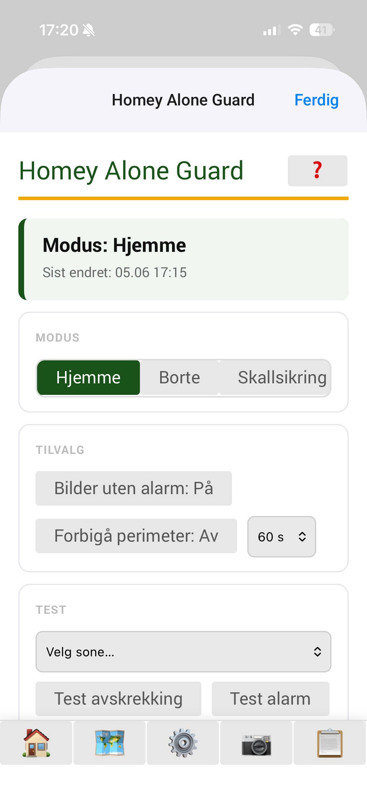
  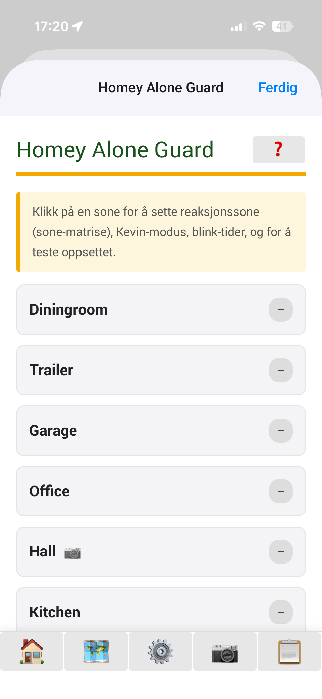
  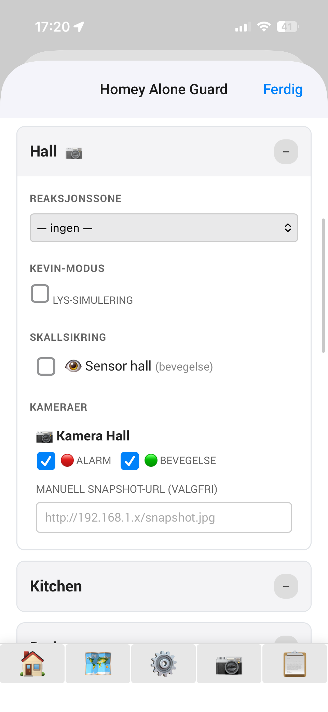
</p>
<p align="center">
  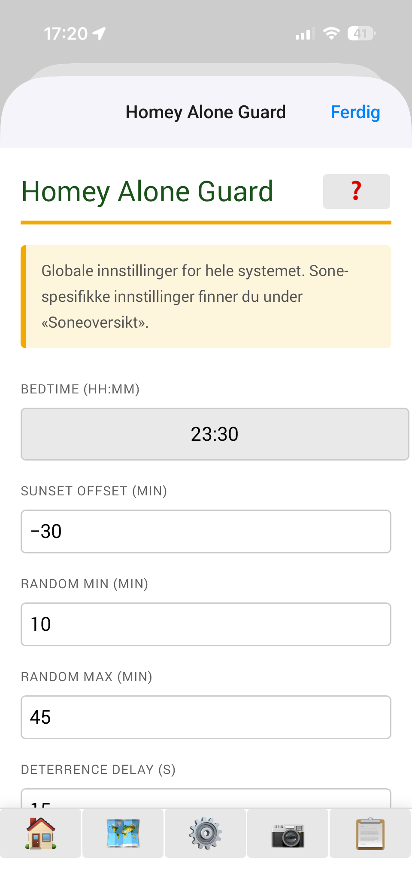
  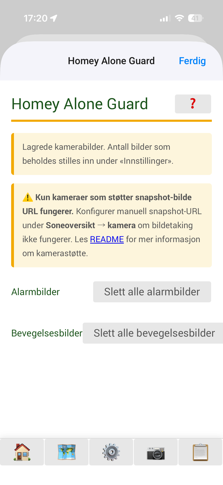
  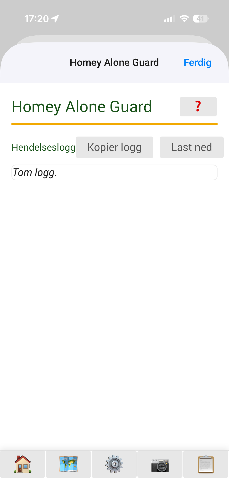
</p>

## Architecture

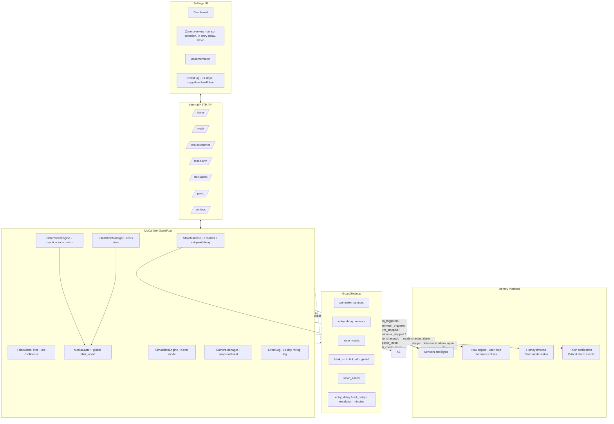

### Mode state machine

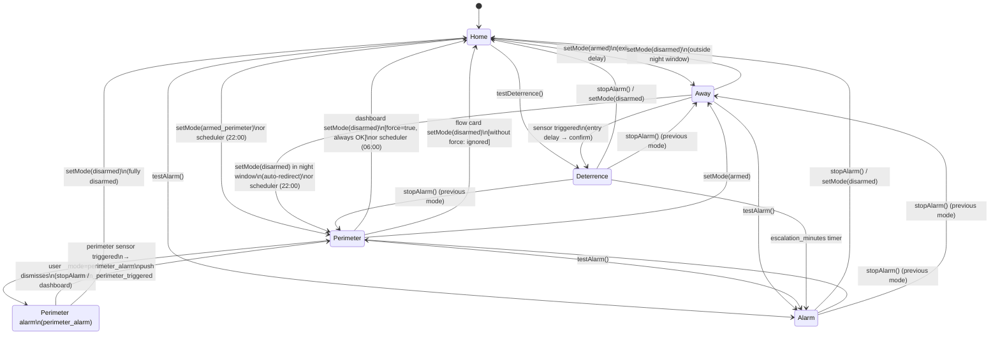

### Sensor routing — from detection to crisis

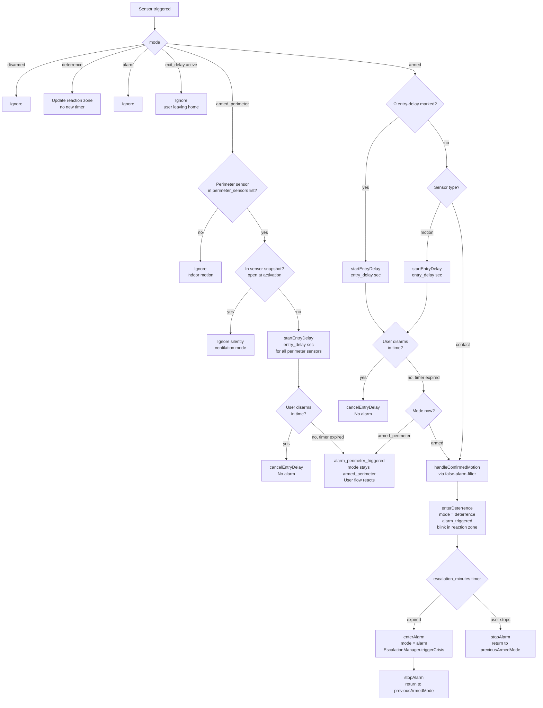

### Entry delay (⏱) — authorised entry with smart lock

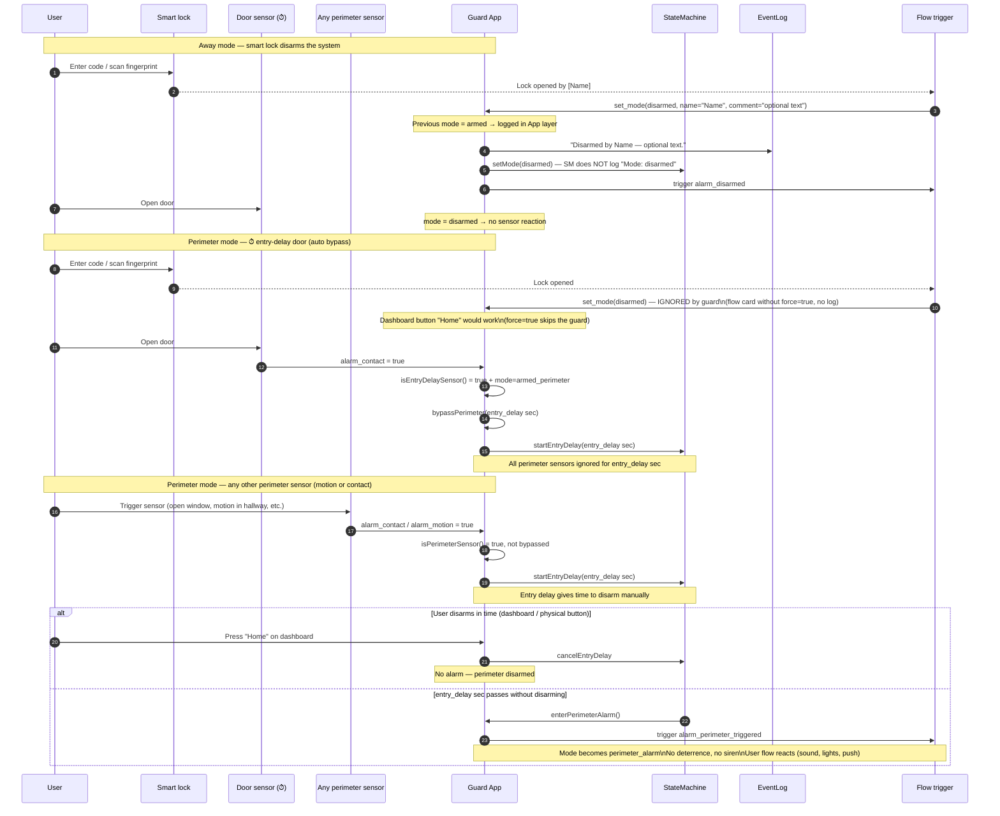

### Deterrence flow — built-in light blinking and mode change

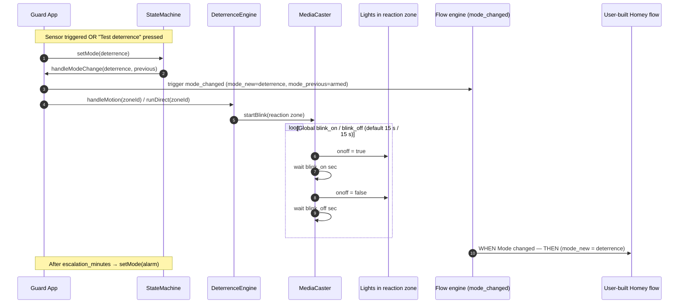

## Components

| Module | Responsibility |
|---|---|
| `app.ts` | Main class — orchestration, sensor listeners, alarm state, entry-delay routing for motion + ⏱ doors |
| `StateMachine` | Mode + entry/exit delays (shared timer for both motion and ⏱ doors) |
| `DeterrenceEngine` | Selects reaction zone from `zone_matrix` and starts light blinking in the reaction zone |
| `MediaCaster` | Light blinking in the reaction zone with global ON/OFF cycle (`blink_on`/`blink_off` in Settings, default 15 s / 15 s) |
| `EscalationManager` | Timer from deterrence to full crisis + strobe routine on all lights |
| `FalseAlarmFilter` | Requires (contact + motion) or motion in two zones within 90 s before escalation |
| `SimulationEngine` | Kevin mode: light patterns in Away mode on marked zones |
| `CameraManager` | Snapshot burst from zone cameras at alarm (skips zones without cameras). Only cameras with a snapshot URL are supported. |
| `EventLog` | Structured internal event log — rolling 14-day window (shown in Event Log tab with copy/download/clear) |
| `Capabilities` | Classifies devices (`isLight` requires `device.class === 'light'`) for UI display and blink selection |

## Flow cards

### Triggers

| Card | Tokens | When |
|---|---|---|
| `alarm_triggered` | `zone`, `sensor`, `sensor_type`, `mode`, `timestamp`, `snapshot` (image, if available) | Sensor activates alarm in **Away** (`armed`) — after entry delay |
| `alarm_perimeter_triggered` | `zone`, `sensor`, `sensor_type`, `mode`, `timestamp`, `snapshot` (image, if available) | Perimeter sensor triggered in **Perimeter** mode — mode set to `perimeter_alarm`, push sent, user flows react — after entry delay window |
| `alarm_stopped` | `zone`, `sensor`, `reason` | Away alarm stopped (by user, disarm or automatically) |
| `alarm_perimeter_stopped` | `zone`, `sensor`, `reason` | Perimeter alarm stopped |
| `mode_changed` | `mode_new`, `mode_previous` | System changes mode — including transition to `deterrence` and `alarm` |
| `snapshot_taken` | `zone`, `sensor`, `sensor_type`, `mode`, `timestamp`, `snapshot` (image) | Camera takes snapshot at alarm |
| `health_check_failed` | `offline_count` | Sensors are offline at arming |

### Conditions

| Card | State |
|---|---|
| `alarm_active` | System is in `alarm` mode (full alarm triggered) |
| `alarm_perimeter_active` | System is in `armed_perimeter` **or** `perimeter_alarm` — Perimeter mode active (monitoring or alarm) |
| `get_mode` | System is in selected mode — dropdown with all 6 modes (including `perimeter_alarm`) |
| `alarm_triggered_in_zone` | Active alarm or perimeter alert was triggered by a sensor in the selected zone — autocomplete zone picker. Use this to run different deterrence reactions per zone. |

### Actions

| Card | Effect |
|---|---|
| `set_mode` | Set mode to Home / Away / Perimeter. Optional **name** appears in Timeline when disarming from Away mode. Optional **comment** is always logged in the event log when set — appended to the "Disarmed by" line from Away, or as a separate line for other mode changes. |
| `trigger_deterrence` | Test deterrence directly in a selected zone |
| `trigger_alarm` | Test full alarm (escalation, stops after 15 s) |
| `bypass_perimeter` | Temporarily disable perimeter sensors (number of minutes) |
| `set_camera_motion` | Enable / disable motion-triggered camera recording |
| `get_media_url` | Returns a `Media URL` tag for a selected bundled media file. Alternative to global tokens when you need to choose the file dynamically at runtime in a flow. |

### Global flow tokens — bundled media

All bundled media files are registered as **permanent global flow tokens** when the app starts. They appear as pills in the Homey flow editor under **McCallister Guard** and can be inserted directly into any action field that accepts a URL or string — without running any intermediate action card first.

| Token | Description |
|---|---|
| `Media: Alarm beep` | Short repeating beep — general alert |
| `Media: Fire alarm` | Fire alarm tone |
| `Media: Guard dog (audio)` | Barking dog — audio only |
| `Media: Intruder warning (voice)` | Spoken intruder warning |
| `Media: Police siren` | Police siren sound |
| `Media: Blue lights (video)` | Flashing blue lights video loop |
| `Media: Cop silhouette (video)` | Police officer silhouette video |
| `Media: Large dog (video)` | Large barking dog video |

**How to use in a flow:**
1. Open a flow action that has a URL or text field (e.g. Chromecast "Cast video", Sonos "Play URL").
2. Click the field, then click the **pills icon** (tag icon) in the input bar.
3. Under **McCallister Guard** select the media token you want.
4. The token resolves to the correct local URL automatically — always pointing to your Homey Pro regardless of IP changes.

> The `get_media_url` action card is still available for flows where you need to select the file dynamically (e.g. from a variable or condition result). For static use, prefer the global tokens.


## Alarm types — two trigger cards

| Situation | Trigger card | Mode change |
|---|---|---|
| Perimeter sensor triggered in **Perimeter** mode (you are home) | `alarm_perimeter_triggered` | `armed_perimeter` → **`perimeter_alarm`** (soft alarm — no siren) |
| Motion/contact in **Away** mode (nobody home) | `alarm_triggered` | `armed` → `deterrence` → `alarm` (full escalation) |

> **Key design decision — Perimeter mode:**
> `armed_perimeter` is for when you are **home and sleeping**. Automatic lighting, sirens or
> deterrence would wake you unnecessarily. The app sets the mode to `perimeter_alarm`, sends push and
> fires the flow card — you decide what happens via your own Homey flows. This gives full
> control without noise. Dismiss the alarm by pressing "Stop alarm" in the dashboard — the system returns
> to `armed_perimeter` (Perimeter mode continues).

### Typical reaction per source

| Source | Typical flow reaction |
|---|---|
| `alarm_perimeter_triggered` | Play a soft chime on the hallway speaker, push to you alone, turn on one light — you are home and can react yourself |
| `alarm_triggered` | Full push to all household members, camera snapshot, start siren/blink throughout the house, call emergency contact |

### Example flows — alarm reaction

> **Note:** The app already automatically sends push to the Homey app for all alarm events.
> The flows below are for additional reactions (sound, lights, Pushover with image, neighbour alerts, etc.)

```
WHEN  Perimeter breach detected (alarm_perimeter_triggered)
      — you are home, low-noise notification
THEN  Play soft chime on hallway speaker
      Slowly raise hallway light (10% brightness)
      Pushover: Send push with image [[snapshot]] to you alone

WHEN  Alarm triggered (alarm_triggered — Away mode)
      — nobody home, full response
THEN  Pushover: Send message with image [[snapshot]] to ALL household members
      Start siren + blink throughout house
      Call emergency contact via IFTTT/SMS

WHEN  Mode changed (mode_changed, mode_new = alarm)
THEN  Send SMS to police / emergency contact
```

### Recommended flows — per-zone deterrence

Use the `alarm_triggered_in_zone` condition to run different reactions depending on which zone triggered the alarm. Use the **global media token pills** directly in the URL field of any Chromecast or speaker action:

```
WHEN  Alarm triggered (alarm_triggered)

IF    Alarm was triggered in zone [Living room]
THEN  Chromecast (living room TV): Cast video [Media: Blue lights (video)]

IF    Alarm was triggered in zone [Hallway]
THEN  Sonos (hallway): Play URL [Media: Guard dog (audio)]
```

The `[Media: Blue lights (video)]` and `[Media: Guard dog (audio)]` items are global token pills — select them from the pill picker (tag icon) in the action's URL field under **McCallister Guard**.

### Recommended flows — disarming and arming

#### Disarming via smart lock (recommended)

Connect disarming to **authorised unlocking of a smart lock** with the user's name as a token.
Do not use presence sensors (GPS/Bluetooth) to disarm — they are too imprecise and can
turn off the alarm while you are visiting neighbours.

```
WHEN  Smart lock: Lock opened by [user]         ← smart lock trigger with name token
THEN  Set mode to Home by [[user]]              ← set_mode action (name = lock's user token)
```

**What happens in different modes:**

| Active mode | Result |
|---|---|
| `armed` (Away) — outside night window | System disarms normally before the door opens — no alarm |
| `armed` (Away) — **in night window** | `set_mode=disarmed` is automatically redirected to `armed_perimeter` — the house goes to Perimeter mode instead of fully disarming. Prevents a smart lock flow from leaving the house unprotected at night. |
| `armed_perimeter` (Perimeter) | `set_mode=disarmed` from the **dashboard** always works (force=true). `set_mode=disarmed` from a **flow card without force** is ignored — the front door has an entry delay that starts perimeter bypass automatically. |
| `disarmed` | No effect |

> **Night window redirect:** Redirection from `armed` to `armed_perimeter` only applies when the built-in Perimeter scheduler is enabled (Settings → Perimeter auto) and the clock is within the configured time window (e.g. 22:00–06:00). The automatic scheduler and `force=true` from internal flows bypass this logic.

#### Arming — recommended strategy

> ⚠️ **Important about presence-based arming and disarming**
>
> WiFi- and GPS-based presence (Homey presence, mobile GPS) is *unreliable* as a sole source
> for controlling the alarm. A weak WiFi signal — e.g. on the terrace, in the garage or in the basement — can
> incorrectly register you as "away", activate the alarm, and trigger it again when you come
> indoors and the signal returns. This is a known failure mode and can cause false alarms even if
> you have been home the whole time.
>
> **Recommendation:**
> - Use presence to **activate** (arm) the alarm — but always with an exit delay and preferably in
>   combination with a physical button or app as an override
> - **Never disarm automatically based solely on presence** — always use a smart lock or
>   manual disarming via dashboard/app
> - Add a **physical button at the entrance** that activates/deactivates the alarm — reliable,
>   fast and works without internet
> - Use the **McCallister Guard app** (dashboard) for manual control when the button is not available

**Recommended setup: presence arms, but button/lock disarms**

```
WHEN  Presence: Nobody home                     ← Homey presence / zone trigger
AND   Mode is [Home (disarmed)]                 ← get_mode condition
THEN  Set mode to Away                          ← set_mode = armed

WHEN  Smart lock: Lock opened by [user]         ← reliable entry trigger
THEN  Set mode to Home by [[user]]              ← set_mode action — always disarms

WHEN  Button pressed (at entrance)              ← physical Zigbee/Z-Wave button
THEN  Set mode to Home                          ← quick manual disarming
```

> **Note:** Use `get_mode = disarmed` as a condition on the presence flow to avoid it
> overriding an active `armed_perimeter` (night mode) when everyone leaves in the morning.

#### Activating Perimeter mode (night mode)

```
WHEN  Time is 22:00
AND   Mode is [Home (disarmed)]
THEN  Set mode to Perimeter
```

Alternatively: use the built-in scheduler in the app (Settings → Perimeter auto).

> **The scheduler only activates at transitions.** Activation occurs exactly when the clock passes the ON time (e.g. 22:00) and deactivation at the OFF time (e.g. 06:00). On app start, no automatic activation/deactivation is done — the saved mode is kept as-is.

#### Ventilation mode — Perimeter mode with open windows

When Perimeter mode is activated the app takes a snapshot of which **configured perimeter sensors** are already open. These sensors are silently ignored for the rest of the session — you can sleep with a window ajar without triggering an alarm. New openings (windows/doors opened *after* activation) react normally.

> **Note:** The snapshot only uses sensors explicitly configured as perimeter sensors in the Zone overview. If no sensors are configured, no snapshot is taken.

```
Example:
  22:00 — Perimeter mode activated
          Bathroom window: alarm_contact = true  ← already open → ignored
          Front door:      alarm_contact = false ← closed → normal protection

  23:15 — Someone opens the kitchen door
          alarm_contact = true (new opening) → entry delay starts → alarm
```

The snapshot is automatically reset when Perimeter mode is deactivated.

#### Automatic push notifications — overview

The app sends push notifications to the Homey app for all critical events without the user needing to set up flows:

| Event | Push message / Timeline |
|---|---|
| System disarmed | `Alarm off` |
| Away mode activated | `Alarm on` |
| Perimeter mode activated | `Alarm perimeter` |
| Disarmed by named user | `Disarmed by [name]` |
| Motion/contact triggers deterrence (Away) | `🚨 Deterrence: [sensor] in [zone]` |
| Perimeter sensor triggers alarm (Perimeter) | `🚨 Perimeter alarm: [sensor] in [zone]` |
| Deterrence escalates to full alarm | `🚨 ALARM triggered in [zone] — [sensor]` |
| Alarm stopped | `Alarm stopped` |
| Open sensors at arming | See table below |
| Sensors offline at health check | `⚠️ Armed, but N sensor(s) not reporting: [name]` |

Push notifications are best-effort — all events are always logged in the internal event log regardless of network status.

#### Open sensors at activation — push notification

Both arming modes send a push notification to the Homey app if there are open door/window sensors at activation:

| Mode | Sensor check | Notification |
|---|---|---|
| **Away** (`armed`) | All contact sensors | Push: "N door/window open at activation: [name]" |
| **Perimeter** (`armed_perimeter`) | Only configured perimeter sensors | Push: "Perimeter armed: N sensor(s) open — ignored: [name]" |

Arming is not stopped — the notification is informational. In Perimeter mode, already-open perimeter sensors are automatically ignored (ventilation mode).

#### Health check at Away activation

The app also checks whether any sensors are offline (unavailable). If any are unavailable, a separate push notification is sent and a warning is logged.

---

## What is logged where

McCallister Guard uses three separate log channels with different purposes:

| Channel | What | Detail level | Duration |
|---|---|---|---|
| **Homey timeline** | Mode changes and critical alarm events | Short and concise — only what the user needs to see | Managed by Homey |
| **Push notification** | All critical events (deterrence, alarm, open sensors, offline sensors) | Short message with sensor and zone | Immediate, best-effort |
| **Internal event log** (Event Log tab) | Full technical detail for all events | Sensor ID, zone ID, reason, timestamp, mode | 14-day rolling window |

### Homey timeline — what is posted

The timeline only shows high-level mode changes. Icons/app logo appear automatically — the app does not add its own app name to the text.

| Event | Timeline text |
|---|---|
| System disarmed | `Alarm off` |
| Away mode activated | `Alarm on` |
| Perimeter mode activated | `Alarm perimeter` |
| Perimeter sensor triggered (Perimeter alarm) | `🚨 Perimeter: [sensor] in [zone]` |
| Perimeter alarm stopped | `Perimeter alarm stopped` |
| Deterrence started (as mode) | `Deterrence` |
| Full alarm (as mode) | `🚨 ALARM` |
| Disarmed by named user | `Disarmed by [name]` |
| Alarm stopped manually | `Alarm stopped` |

### Push notifications — what is sent

Push notifications are sent in addition to timeline entries for all critical events:

| Event | Push message |
|---|---|
| Perimeter sensor triggered (Perimeter mode) | `🚨 Perimeter: [sensor] in [zone]` |
| Sensor triggers deterrence (Away) | `🚨 Deterrence: [sensor] in [zone]` |
| Deterrence escalates to full alarm | `🚨 ALARM triggered in [zone] — [sensor]` |
| Open sensors (Away mode) | `⚠️ N door/window open at activation: [name]` |
| Open sensors (Perimeter mode) | `ℹ️ Perimeter armed: N sensor(s) open — ignored: [name]` |
| Sensors offline | `⚠️ Armed, but N sensor(s) not reporting: [name]` |

### Internal event log — what is written

The internal log (Event Log tab in settings) contains all technical detail that does not fit in the timeline:

- Which sensor triggered the event (name + device ID)
- Which zone the event occurred in
- Reason for alarm stop (user, auto-stop, timeout)
- Entry delay countdowns (start, cancelled, expired)
- FalseAlarmFilter assessments (confidence threshold, reset)
- Light switching off after alarm ("N lights turned off")
- Snapshot activity from CameraManager
- All error messages and best-effort warnings

**Mode changes and logging:**

| Mode change | What is logged |
|---|---|
| → `armed` | `Mode: armed.` |
| → `armed_perimeter` | `Mode: armed_perimeter.` |
| → `deterrence` | `Mode: deterrence.` |
| → `alarm` | `Mode: alarm.` |
| → `disarmed` (from `armed`) | `Disarmed by [name] — [comment].` — StateMachine does **not** log `Mode: disarmed` separately, since the flow handler already covers this with more information |
| → `disarmed` (from other modes) | No log — no-op or blocked by design |

The log can be copied to the clipboard, downloaded as CSV or cleared from the Event Log tab. Rolling window — entries older than 14 days are automatically deleted.

---

### Design decision — log noise from mode changes

#### The problem

Three sources of log noise were identified:

**1. Door opening in Home and Perimeter mode**

A common flow recipe is to connect door sensors (or presence) to the `set_mode` action to automatically disarm when someone enters:

```
WHEN  Door sensor: Door opened
THEN  Set mode to Home by [[user]]
```

This flow works correctly in **Away** mode — the system disarms, and the event is logged with the correct user. But if the flow runs in **Home** (`disarmed`) or **Perimeter** (`armed_perimeter`), these log entries were generated **on every door opening**:

- `"Disarmed by Thomas"` — even though the system was already disarmed (no-op)
- `"Perimeter remains active — disarm ignored."` — for every door opened while Perimeter was active

**2. Double log when disarming from Away mode**

When `set_mode=disarmed` actually changed the mode from `armed`, the system produced two log entries at the same second:
- `"Disarmed by Thomas."` — from the flow handler
- `"Mode: disarmed."` — from StateMachine

Same event, two lines.

**3. One log line per open sensor at Perimeter activation**

When Perimeter was activated with open sensors (ventilation mode), one line was logged per sensor instead of one combined line.

#### Alternatives considered (problem 1)

| Alternative | Assessment |
|---|---|
| **`silent` parameter on the `set_mode` card** | Requires the user to actively set the parameter on all relevant flows — not flexible enough, and other users of the app don't know about the convention |
| **Separate "silent" flow card** | Same problem as the parameter, plus it creates unnecessary duplication of flow cards |
| **Using `"Manual"` as a special name to suppress logging** | Overloads the semantics of a name field with behaviour logic — not intuitive and fragile |
| **Fix the root cause in the `set_mode` handler** | ✅ No new parameters, no new cards, no special strings — works automatically for everyone |

#### Chosen solutions

**Problems 1 and 3 — `set_mode` handler and open sensor logging:**

The log entry `"Disarmed by [name]"`, timeline posting and the `alarm_disarmed` trigger fire **only when the previous mode was `armed` (Away)**. The former `"Perimeter remains active — disarm ignored."` message has been removed — the guard still blocks, but silently. Open sensors at Perimeter activation are logged as one combined line.

**Problem 2 — `StateMachine.applyMode`:**

`StateMachine` no longer logs `"Mode: disarmed."` — the flow handler always produces a more informative entry (`"Disarmed by [name]"`) at the same moment, making the StateMachine line pure noise.

**Combined effect on flows:**

| Active mode | `set_mode=disarmed` from flow | Log entries |
|---|---|---|
| `armed` (Away) | Disarms the system | `"Disarmed by [name] — [comment]."` — one line |
| `disarmed` (Home) | No-op | — none |
| `armed_perimeter` (Perimeter) | Blocked (design) | — none |

The flow can run on all door openings without cluttering the log — only actual disarms from Away mode produce a log line, and never double.

---

### Recommended flows — camera snapshots at alarm

> **Homey limitation:** The app cannot take photos from cameras directly. Homey does not allow
> a third-party app to call another app's action card (e.g. "Take snapshot") from code — this
> is only possible from the Flow editor. You must therefore create **one flow per camera** you want to trigger.

The app sends the `zone` token with `alarm_triggered` and `alarm_perimeter_triggered`. Use this
as a condition to select the correct camera:

```
WHEN  Alarm triggered (alarm_triggered)
AND   [[zone]] contains "Entrance"          ← Homey Logic: text condition
THEN  [Camera app]: Take snapshot from [entrance camera]
      Telegram: Send message with image [[snapshot]]

WHEN  Alarm triggered (alarm_triggered)
AND   [[zone]] contains "Garage"
THEN  [Camera app]: Take snapshot from [garage camera]
      Telegram: Send message with image [[snapshot]]
```

**Prerequisite:** The camera app (Reolink, Eufy, Unifi Protect, ONVIF etc.) must have a
"Take snapshot" action card in the Flow editor that returns an image token. Check this in
the camera app's documentation on the Homey App Store.

**Available tokens from the app:**

| Token | Content |
|---|---|
| `[[zone]]` | Name of the zone where the sensor triggered the alarm |
| `[[sensor]]` | Name of the sensor that triggered the alarm |
| `[[sensor_type]]` | `motion` or `contact` |
| `[[mode]]` | Active mode when the alarm was triggered |
| `[[timestamp]]` | ISO 8601 timestamp |
| `[[snapshot]]` | Image token — camera snapshot (if a camera is configured in the zone) |

---

### Recommended flows — sound and video for deterrence

> **Homey limitation:** The app cannot start audio or video playback on speakers, TVs
> or Chromecasts directly from code. Homey's platform exposes third-party apps' flow cards
> (e.g. "Play sound", "Cast video") **only via the Flow editor** — not via any API a custom app
> can call. You must therefore create flows manually to connect deterrence to sound and video.

The app fires `mode_changed` (mode_new = deterrence) and `alarm_triggered` / `alarm_perimeter_triggered`
as integration points. Light deterrence (blink in reaction zone) always runs automatically —
sound and video must be set up as user flows.

Insert the bundled media files as **global token pills** (tag icon → McCallister Guard) directly into any URL field:

```
WHEN  Mode changed (mode_changed)
AND   mode_new = deterrence
THEN  Sonos / speaker: Play URL [Media: Guard dog (audio)] at volume 80%
      Chromecast: Cast video [Media: Blue lights (video)] to living room TV

WHEN  Alarm triggered (alarm_perimeter_triggered)
THEN  [Hallway speaker]: Play URL [Media: Police siren]
      Push to YOU: "Someone at [[sensor]]"

WHEN  Mode changed (mode_changed)
AND   mode_new = disarmed
THEN  Sonos: Stop playback
      Chromecast: Stop playback
```

**Tips:**
- Use the `alarm_triggered_in_zone` condition to play different sounds depending on which room triggered the alarm.
- Your own flows can safely control lights in the reaction zone in parallel with built-in blinking.
- Volume control on third-party speakers must be done in the same flow — the app does not have access to this from code.


## Set up flows based on mode changes

The system has six modes: `disarmed` (Home), `armed` (Away), `armed_perimeter` (Perimeter), `perimeter_alarm` (Perimeter alarm triggered), `deterrence` (Deterrence), `alarm` (Alarm triggered). Transitions between these always fire the `mode_changed` trigger with `mode_new` and `mode_previous` as tokens.

### General pattern

In the Flow editor (Homey app → Flows → New flow):

1. **WHEN** — `McCallister Guard → Mode changed`
2. **AND** *(optional)* — filter on `[mode_new]` or `[mode_previous]` to react to specific transitions.
3. **THEN** — run desired action (push, SMS, turn on lights, activate scene, etc.)

### Example 1 — push when deterrence starts

```text
WHEN  McCallister Guard → Mode changed
AND   mode_new = deterrence
THEN  Homey → Send a push notification
        Title:  Deterrence active
        Text:   Lights blinking. Check camera in the Homey app.
```

### Example 2 — call emergency contact at full alarm

```text
WHEN  McCallister Guard → Mode changed
AND   mode_new = alarm
THEN  Call emergency contact via IFTTT/SMS
      Send push with highest priority to all
```

### Example 3 — log mode history

```text
WHEN  McCallister Guard → Mode changed
THEN  Google Sheet → Add row: [mode_new], [mode_previous], [timestamp]
```

### Testing and troubleshooting

- The **"Test deterrence"** button in the Zone overview sets the system to `deterrence` mode directly — use it to verify that flows listening on `mode_changed` (mode_new = deterrence) work.
- The **"Test alarm"** button in the Zone overview sets the system to `alarm` mode and stops after 15 seconds.
- In the **Event Log** you always see the current mode line at each mode change.
- Use the `get_mode` condition to check the active mode in flows without listening to `mode_changed`.


## Installation

### Requirements

- Homey Pro (Early 2023 or newer) with firmware ≥ 12.4.0
- Node.js 18+ and npm for development
- [Homey CLI](https://apps.developer.homey.app/the-basics/getting-started/cli)

### Build and install on Homey

```bash
git clone https://github.com/thomasekdahlN/mccallisterguard.git
cd mccallisterguard
npm install
homey app install
```

### Configuration

1. Open **Settings → Apps → McCallister Guard → Configure app**.
2. Under **Zone overview**, expand each zone and see which capabilities (🔊 audio, 📺 screen, 💡 lights) and sensors
   (🚪 door/window, 👁️ motion) have been detected.
3. Define the **reaction zone matrix** per zone — e.g. "motion in attic → play deterrence in living room".
4. **Perimeter mode:** in each zone all door/window and motion sensors are listed. The first checkbox
   marks the sensor as active in Perimeter mode (typically exterior doors, windows, outdoor areas). Other sensors
   are ignored when Perimeter mode is active.
5. **Entry delay (⏱):** for door/window sensors you can check **⏱** to give the sensor an
   entry delay. When such a door is opened (in Away or Perimeter mode), a countdown of
   `entry_delay` seconds (default 30) starts before the alarm fires — so an authorised user entering with
   a key pad/smart lock has time to disarm without triggering the siren. Recommended for the front door and
   back door with a key pad. Combine with a flow that automatically sends `set_mode = Home` when the smart lock
   reports authorised unlocking — then no alarm fires at all, and the entry delay is the fallback if the flow fails.

   > **Note:** `set_mode = Home` is ignored if the system is in **Perimeter** mode. Someone coming home late
   > does not automatically deactivate night mode — change mode manually on the dashboard if needed.
   > Sending `set_mode = Home` while the system is in **Alarm** stops the alarm and fully disarms the system.
6. **Global light deterrence:** the app blinks lights in the reaction zone with a slow ON/OFF cycle (default
   15 s each way, adjustable globally under **Settings → Deterrence light on/off (sec)**). Your own flows can safely
   control lights in the zone in parallel with built-in blinking. Use the `mode_changed` trigger (mode_new = deterrence)
   for flows that react to deterrence.
7. Set **Away mode** when you leave the house, or use the `set_mode` action from a flow (geofence, button,
   voice). Use the `mode_changed` trigger for logging or automation around mode changes.

## Development

```bash
npm test              # Vitest unit tests (41 tests)
npx tsc --noEmit      # TypeScript type check
npm run lint          # ESLint (Athom config)
npm run build:images  # Regenerate App Images (250×175 / 500×350 / 1000×700) from design/appartwork.png
homey app validate --level publish  # Athom App Store validation
homey app run         # Run locally against Homey for live testing
```

### Graphics and master files

Athom distinguishes between two types of app graphics; we follow the same terminology.

| Type | Master (`design/`) | Distribution (`assets/`) | Requirements |
|---|---|---|---|
| **App Icon** (small, round monochrome badge) | `design/appicon.svg` (and `appicon.png` for preview) | `assets/icon.svg` | Vector, viewBox 0 0 1024 1024 |
| **App Images** (colourful App Store artwork) | `design/appartwork.png` | `assets/images/small.png` (250×175), `large.png` (500×350), `xlarge.png` (1000×700) | PNG, exact dimensions (10:7) |

The app icon is copied directly (same SVG as master). App Images are regenerated from `design/appartwork.png` with `npm run build:images` — the script uses macOS-native `sips` and fit-cover + center-crop to preserve the aspect ratio without distortion.

### Folder structure

```
McCallisterGuard/
├── app.ts                  # Main class
├── api.ts                  # Internal HTTP API for settings UI
├── lib/                    # Modules (StateMachine, DeterrenceEngine, …)
├── settings/index.html     # Settings UI (vanilla JS)
├── assets/icon.svg         # App Icon (badge) — copy of design/appicon.svg
├── assets/images/          # App Images (App Store artwork) — generated from design/appartwork.png
├── assets/media/           # Bundled CC audio/video files
├── design/                 # Master files for graphics (appicon, appartwork)
├── scripts/                # Helper scripts (build-app-images.sh)
├── .homeycompose/flow/     # Flow cards (triggers, conditions, actions)
├── docs/                   # Specification and architecture
└── test/                   # Vitest unit tests
```

### Test strategy

| Test | Covers |
|---|---|
| `StateMachine.test.ts` | Mode transitions, entry/exit delays |
| `FalseAlarmFilter.test.ts` | Confidence threshold and reset logic |
| `EventLog.test.ts` | Structured logging, 14-day rolling window, clear() |

## Casting to Chromecast / Samsung TV — what we learned

A major goal of the app was to programmatically play video ("blue lights in the window", silhouette of a large person, barking dog) on Chromecast, Google Nest Hub and Samsung TV. This turned out to be **significantly harder** than expected on the Homey platform. These findings are noted here so we do not repeat the exploration — and because they represent a real weakness in the Homey ecosystem.

### What we tried

| # | Approach | Result |
|---|---|---|
| B | Use `speaker_playing` capability on the cast device | Limited — can only resume a previous cast session, not select URL or media |
| C | Auto-generate Homey flows programmatically from app code | ❌ Blocked — `homey:manager:api` permission gives only `homey.flow.readonly` for third-party apps |
| E | HomeyScript bridge: call `homey.flow.runFlowCardAction({ uri, id, args })` from a script | ❌ Blocked — even HomeyScript with full user scopes (`homey.flow`) gets `Not Found: FlowCardAction with ID castVideo` on all 1044 tested combinations |
| D | Embed `castv2-client` directly in the app and speak the Chromecast protocol | Theoretically possible, but requires IP discovery (we only have Homey device ID), maintenance when Google changes the protocol, separate Tizen implementation for Samsung — and breaks Athom's recommended architecture |
| A | User manually creates a Homey flow, app fires a trigger the flow listens on | ✅ **Works** — the Flow editor has separate access to all apps' flow cards |

### Why B/C/E fail

Third-party apps on Homey (such as Chromecast and Samsung TV) expose their flow cards **exclusively via the Flow editor's internal interface**. These cards are not available via:

- Web API / `homey-api` SDK
- HomeyScript (even with `homey.flow` scope)
- App-to-app calls within a custom app

This is a deliberate architectural boundary from Athom — or a bug — but the result is the same: a custom app **cannot** programmatically ask the Chromecast app to play a URL. Even "universal" actions such as `Cast a video` and `sendKey` consistently return `Not Found` when called from outside the Flow editor.

We have also verified that the `cast_url` capability is not exposed on Chromecast/Samsung TV devices in practice — only on a small number of driver implementations (typically LG WebOS and some projector apps).

### What we did instead — mode-based integration

The pivot was solution A: **the system changes mode to `deterrence` when deterrence starts, and the user optionally builds their own flow** that reacts to `mode_changed` (mode_new = deterrence). The flow can then run `Cast a video` / `Cast a website` on Chromecast or `Send key` on Samsung TV.

Built-in light deterrence (`MediaCaster.startBlink` — slow ON/OFF cycle on light devices in the reaction zone, global timing configurable in Settings, default 15 s each way) **always runs** when deterrence starts. This gives a sensible out-of-the-box system and ensures the user gets visual deterrence even if the Chromecast is offline or the flow is disabled.

Your own flows can safely control lights in the zone in parallel with the blinking.

### Implications for future Homey apps

If you plan an app that needs to control third-party devices (especially media) via their "nice" flow actions: assume you **must** design the solution around the user creating a flow themselves. A trigger card from your own app is the only reliable bridge to other apps. Document this clearly in the UI.

## Homey platform limitations — features we have had to remove or delegate

Along the way we have removed functionality that **seemed right on paper, but which the Homey platform does not actually allow a custom app to do**. We leave this list here explicitly so the next developer (and ourselves in six months) does not spend days rediscovering why these paths do not work.

| Feature we tried | Why it does not work on Homey | What we do instead |
|---|---|---|
| **Direct cast of audio/video to Chromecast / Nest Hub / Samsung TV from app code** | Third-party apps' flow actions (`Cast a URL`, `Cast a video`, `sendKey`) are only exposed via the Flow editor's internal interface, not via Web API, HomeyScript or app-to-app calls. | User builds a flow that listens on `mode_changed` (mode_new = deterrence) or `alarm_triggered` and routes to the Chromecast action themselves. All bundled media files are available as **global flow token pills** — no URL typing needed. |
| **Per-zone audio URL and video URL in settings (`zone_audio_urls`, `zone_video_urls`)** | There was no reliable way to play these at runtime — `cast_url` capability is almost never exposed on Chromecast/Samsung devices. The fields were just a promise we could not keep. | Removed entirely. User selects a media token pill in their own flow action. |
| **Global "Default audio URL" field (`custom_audio_url`)** | Same limitation — we could not call any action to play it. | Removed entirely. Bundled media is now available as global token pills. |
| **Cast device prioritisation per zone (`cast_devices`, `CastPriority` module)** | We could rank devices, but not actually push content to them programmatically. Pure UI with no effect. | Removed entirely. The `Capabilities` module still reports that a zone has a screen/speaker in the info badge, but no longer selects the "best" device. |
| **Auto-generate Homey flows programmatically from app code** | `homey:manager:api` permission gives custom apps only `homey.flow.readonly` — no `create`/`update` on flows. | User must manually create a deterrence flow. We document the pattern clearly in the zone UI and README. |
| **HomeyScript bridge to call third-party app actions** (`homey.flow.runFlowCardAction({ uri, id, args })`) | Even HomeyScript with full user scopes returns `Not Found: FlowCardAction with ID …` on all 1044 tested uri/id combinations against Chromecast/Samsung. The function is effectively a dead end for custom apps. | Abandoned. Mode changes via the `mode_changed` trigger + user flow is the only working bridge. |
| **Use `speaker_playing` capability to resume cast session** | Only resumes an existing session, not selecting URL/content. Useless for starting deterrence. | Abandoned. |
| **Embed `castv2-client` / Tizen protocol directly in the app** | Requires IP discovery (we only have Homey device ID), parallel maintenance when Google/Samsung changes the protocol, separate implementation per platform — breaks Athom's recommended architecture. | Considered and abandoned. Not worth it. |
| **Cast screen info banner per zone** (warning that detected screen does not support direct cast) | Became misleading — we said "use a Homey flow" without giving the user anywhere to click. | Removed. The `mode_changed` trigger is the official integration point for the user's own flows. |
| **Programmatically select / run a specific Homey flow from app code** (per-zone dropdown with flow ID stored in `deterrent_flows`) | There is **no `runFlow(flowId)` API for third-party apps** on Homey. `homey.flow.getFlows()` is `readonly`, and there is no imperative way to fire a selected flow from code. | Removed entirely. The system changes mode — the user's flow listens on `mode_changed`. The `getFlows` API endpoint (`/flows`) has been removed. |
| **"I have created an external flow" checkbox per zone** (boolean in `deterrent_flows`) | The checkbox had become unnecessary. | Removed. Blink timing is now controlled globally under "Deterrence light on/off (sec)" in Settings (default 15/15). The `deterrent_flows` field is gone; old values are ignored. |
| **600 ms strobing** | Previously lights blinked 600 ms on/off as a police light effect. This worked technically, but often produced an audible clicking sound in relay-based devices, accelerated wear on Hue/IKEA bulbs and caused some zone-to-Zigbee bridges to drop commands due to traffic. | Replaced with a slow ON/OFF cycle controlled by global `blink_on`/`blink_off` (default 15 s each way, adjustable in Settings). |
| **"Blink all devices with `onoff`"** | The previous filter only required `onoff` capability + not a sensor. The result was that heating cables, panel heaters, freezers, smart plugs, fans and TVs were attempted to be strobed during deterrence — unwanted and potentially harmful. | Strict filter: `isLight()` now requires `device.class === 'light'` in addition to `onoff`. Used consistently in `MediaCaster.startLightStrobe`/`stopZone` and `SimulationEngine` (Kevin cycle). If a smart plug should be usable as a light (e.g. a Christmas tree), change `class` to `light` in Homey device settings. |
| **Light authorisation (`LightAuthGuard`)** | The feature detected lights turned on by external sources while the system was armed, and immediately turned them off again. In practice this conflicted with too many legitimate automatic routines: outdoor lights turned on at sunset, alarm clock flows that turn on lights in the morning (even when not at home), and other time-based light flows. There was no simple way to whitelist "allowed" lights without requiring the user to manually configure all light automations. | Removed entirely. The app only controls lights in the reaction zone during active deterrence and alarm strobe — everything else is left to the user's own flows. |
| **Snapshot loop in all zones with motion** | `CameraManager.startForZone()` started a `setInterval` in each zone with motion, filtering out camera devices on each tick. The result was wasted scheduling and loop log noise in zones without cameras. | `startForZone()` now looks up `isCamera(d)` on the zone's devices first and skips the loop entirely if no cameras are found. The log says "Snapshot loop skipped: no cameras in zone X". |

### Where are the images from the snapshot loop shown?

Images are saved to `/userdata/snapshots/alarm/` and `/userdata/snapshots/motion/` and shown in the **Images** tab in the settings UI. Homey's `notifications.createNotification` API only accepts text — it does not support attaching an image directly to a push notification in the Homey app. To send images externally (Telegram, Pushover, email, Dropbox), use the `snapshot` image token now available in the `alarm_triggered` and `alarm_perimeter_triggered` flow cards, and in the `snapshot_taken` trigger.

---

## Camera snapshots — everything we have tried and why it does not work

A key goal was to take photos from cameras at alarm and motion events. This turned out to be significantly harder than expected on the Homey platform. Everything we have tested is documented below so we do not repeat it.

### Overview of attempts

| # | Approach | Result |
|---|---|---|
| 1 | `device.images[0].url` — read image URL directly from the device object | Fails — the field is empty in all cases we have tested |
| 2 | `homeyApi.images.getImage({ id })` — fetch one image via ManagerImages | Fails — the method does not exist in HomeyAPIV3Local |
| 3 | `homeyApi.images.getImages()` + `ownerUri` matching | Partial — only works if the camera driver calls `device.setCameraImage()` |
| 4 | Direct HTTP download with Bearer token | Works technically, but requires a valid URL from approaches 1–3 |
| 5 | `image.getStream()` on image objects from the local API | Fails — the objects are empty JSON stubs with no methods |

### Details per attempt

#### 1. `device.images[0].url`

The natural first step was to read `device.images` directly from the device object returned by `homeyApi.devices.getDevices()`.

**What we found:** The `HomeyAPIV3Local` specification defines `device.images` as an array of *empty objects* (`properties: {}`, `additionalProperties: false`). The field exists in the response, but the content is always empty — no `url`, no `id`, nothing. This is not a documentation error; it is actually how the Web API serialises the device's image list in local mode.

**Conclusion:** Unusable for fetching a URL.

---

#### 2. `homeyApi.images.getImage({ id })`

We tried using `ManagerImages.getImage()` to fetch a single image with a known ID (from the `device.images` list).

**What we found:** The method does not exist. `HomeyAPIV3Local.ManagerImages` has *only* `getImages()` (plural — fetches all). There is no `getImage()` method to fetch one image at a time.

**Conclusion:** Cannot be used.

---

#### 3. `homeyApi.images.getImages()` + `ownerUri` matching

Homey's standardised camera system works as follows:

1. The camera driver calls `device.setCameraImage(image, 'front', 'Front camera')`.
2. The image is registered in `ManagerImages` with `ownerUri: "homey:device:{deviceId}"`.
3. The image is available via `GET /api/manager/images/image/{imageId}`.

We implemented a lookup table: fetch all images with `getImages()`, build a map `deviceId → imageUrl` based on `ownerUri`, and use this when we know the camera ID.

**Code (`CameraManager.refreshZoneCache`):**
```typescript
const allImages = await this.homeyApi.images.getImages();
for (const img of Object.values(allImages)) {
  const match = img.ownerUri?.match(/^homey:device:(.+)$/);
  if (match) deviceImageUrl.set(match[1], img.url);
}
```

**What we found:** Only works if the camera driver actually calls `device.setCameraImage()`. For the cameras we tested, there is nothing in the `getImages()` response that matches the device — the driver does not register images in ManagerImages. This is a driver problem, not something we can work around from the app code.

**Conclusion:** Correct approach for cameras with a standard Homey driver. Fails silently for cameras that do not implement `setCameraImage()`.

---

#### 4. Direct HTTP download with Bearer token

Since the `homeyApi` SDK does not give us image data directly, we tried downloading the JPEG via HTTP using Homey's own local API.

**Flow:**
```
1. homey.api.getLocalUrl()       → base URL (e.g. "http://192.168.x.x")
2. homey.api.getOwnerApiToken()  → Bearer token
3. fetch(baseUrl + imageUrl, { Authorization: `Bearer ${token}` })
4. Buffer.from(await response.arrayBuffer()) → JPEG buffer → write to /userdata/
```

**What we found:** The mechanism works technically. But it requires us to already have a valid `imageUrl` from approaches 1, 2 or 3 — and we do not have one when none of them return a URL. The error is then "no image URL configured" (before the HTTP call is even made).

**Conclusion:** Correct download mechanism. Depends on the URL being resolved from one of the other steps.

---

#### 5. `image.getStream()` on image objects from the local API

The `HomeyAPI` SDK has an `Image` class with a `getStream()` method that returns a Node.js stream. We tried calling this on the image objects returned by `getImages()`.

**What we found:** The image objects from `HomeyAPIV3Local` are pure JSON stubs — they are *not* instances of the `Image` class. They have no methods; only the fields `id`, `url`, `ownerUri` and `lastUpdated`. `getStream()` does not exist on these objects.

`getStream()` only exists on `Image` instances you create yourself via `this.homey.images.createImage()` — i.e. images you produce from the app, not images you fetch from external devices.

**Conclusion:** Cannot be used to fetch a snapshot from a camera.

---

### Root cause

There is **no standardised, guaranteed API** in Homey Web API v3 Local for fetching a snapshot from an arbitrary camera. Everything depends on the camera driver voluntarily implementing `device.setCameraImage()`. If it does not, there is nothing a third-party app can do.

The Homey App Store page for a camera app will typically say "supports snapshot" or list the `camera` capability — check this before choosing a camera app.

### What we do now

`CameraManager` uses approach 3 (ownerUri matching) as the primary source and approach 1 (device.images fallback) as secondary. The download happens via approach 4 (direct HTTP). If no URL is found, a warning is logged and the camera is silently skipped.

For cameras that do not support Homey's native snapshot API, a possible workaround is to enter a manual RTSP/HTTP snapshot URL directly in the settings (not implemented currently — let us know if this is desired).

---

### Known limitations that **still** apply (no known workaround at this time)

- We cannot programmatically know whether the user's flow actually succeeded — `triggerCard.trigger()` only returns that the trigger was fired, not whether any flow picked it up or whether the Chromecast action actually played. That is why we always run the blink fallback in parallel.
- We cannot programmatically trigger a specific flow by ID. The only bridge to a flow is that we fire a trigger and the user's flow listens itself (with a `zone` filter if desired).
- Volume control on third-party speakers from app code is **not** possible for the same reason as casting. If your flow needs to raise the volume, that must also be done as an action in the flow.
- We cannot detect whether a Chromecast/Sonos is in use by someone else when deterrence starts — it is up to the user's flow to handle "interrupt" logic.
- We cannot attach images directly to Homey push notifications (`notifications.createNotification` only accepts text). The app sends text push automatically for all alarm events. For push with an image, use the `snapshot` token in `alarm_triggered` / `alarm_perimeter_triggered` in combination with e.g. the Pushover app in a flow.

---

## ☕ Support the project

McCallister Guard is developed in spare time and shared freely with the entire Homey community — no subscription, no hidden costs, no ads.

If the app protects your home, gives you safer nights, or just saves you the headache you would otherwise have — consider sending a small thank-you. **Even $10 / €10 makes a difference and motivates further development**, new features and faster bug fixes.

> 💳 **PayPal:** [thomas@ekdahl.no](https://paypal.me/ekdahlthomas)
>
> All contributions go directly to AI credits and development time. 🙏

---

## License and credits

- **App code**: MIT — see [LICENSE](LICENSE)
- **Media files**: Creative Commons (CC-BY) — see `assets/media/CREDITS.md`
- **Inspiration**: *Home Alone* (1990), directed by John Hughes — all Kevin traps are pure fan fiction

## Contributing

Issues and PRs are welcome. See [CONTRIBUTING.md](CONTRIBUTING.md) and [CODE_OF_CONDUCT.md](CODE_OF_CONDUCT.md). For larger changes, open an issue first to discuss.
